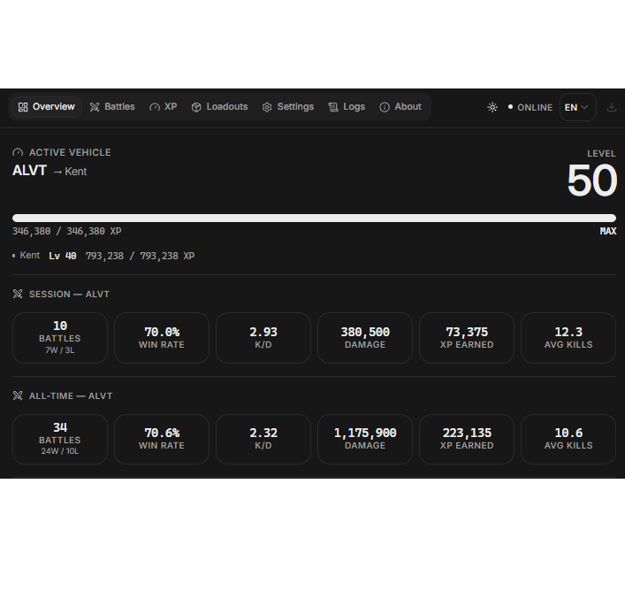

# HEAT Sentinel -- Complete Documentation -- Полная документация

**[English](#0-table-of-contents-en)** | **[Русский](#0-содержание-ru)**

> WoT: HEAT Sentinel is an unofficial statistics gathering app. It is not affiliated with, endorsed by, or sponsored by Wargaming Group Limited. All in-game assets and trademarks belong to their respective owners.

---

## Download

<!-- RELEASE-EN:START -->
[](https://github.com/OxCone1/HEAT-Sentinel/releases/download/v2.0.2/HEAT.Sentinel_2.0.2_x64-setup.exe)

**Latest release:** [v2.0.2](https://github.com/OxCone1/HEAT-Sentinel/releases/tag/v2.0.2) -- published 2026-07-15

| File | Size | VirusTotal report |
|------|------|------|
| [`HEAT.Sentinel_2.0.2_x64-setup.exe`](https://github.com/OxCone1/HEAT-Sentinel/releases/download/v2.0.2/HEAT.Sentinel_2.0.2_x64-setup.exe) (app installer) | 182.7 MB | [View scan](https://www.virustotal.com/gui/file/66597d78e03e450836ce42320b00541788df2d63b8ded605506a1a6221b62c7e) |
| `heat-capture.exe` (capture/watcher engine, bundled inside the installer) | 89.1 MB | [View scan](https://www.virustotal.com/gui/file/f88556adfd36b4727ebe769ed9befba19bd9f0c0c6c39abf870a43155b7c36de) |
<!-- RELEASE-EN:END -->

Every release is built by GitHub Actions and scanned on VirusTotal. See [Security and Privacy](#8-security-and-privacy) for details.

---

## 0. Table of Contents (EN)

| English Table of Contents | Russian Table of Contents |
|---------------------------|---------------------------|
| [Download](#download)<br>0. [Table of Contents (EN)](#0-table-of-contents-en)<br>1. [Navigation](#1-navigation)<br>2. [Project Overview](#2-project-overview)<br>3. [Installation and First Launch](#3-installation-and-first-launch)<br>4. [Stream Overlay and OBS Integration](#4-stream-overlay-and-obs-integration)<br>5. [Data Capture: Main Mode and Legacy OCR](#5-data-capture-main-mode-and-legacy-ocr)<br>6. [Calibrations and Patterns](#6-calibrations-and-patterns)<br>7. [Contributing](#7-contributing)<br>8. [Security and Privacy](#8-security-and-privacy)<br>9. [Future Expansion](#9-future-expansion)<br>10. [Disclaimer](#10-disclaimer) | [Cкачать](#скачать)<br>0. [Содержание (RU)](#0-содержание-ru)<br>1. [Навигация](#1-навигация)<br>2. [Обзор проекта](#2-обзор-проекта)<br>3. [Установка и первый запуск](#3-установка-и-первый-запуск)<br>4. [Оверлей для стрима и интеграция с OBS](#4-оверлей-для-стрима-и-интеграция-с-obs)<br>5. [Захват данных: основной режим и Legacy OCR](#5-захват-данных-основной-режим-и-legacy-ocr)<br>6. [Калибровки и паттерны](#6-калибровки-и-паттерны)<br>7. [Участие в проекте](#7-участие-в-проекте)<br>8. [Безопасность и приватность](#8-безопасность-и-приватность)<br>9. [Планы развития](#9-планы-развития)<br>10. [Дисклеймер](#10-дисклеймер) |

---

## 1. Navigation

| Section | Description | Link |
|---------|-------------|------|
| Project Overview | What HEAT Sentinel is, features, capabilities | [Section 2](#2-project-overview) |
| Installation and First Launch | Download, install, first run | [Section 3](#3-installation-and-first-launch) |
| Stream Overlay and OBS Integration | Overlay editor, OBS setup, real-time sync | [Section 4](#4-stream-overlay-and-obs-integration) |
| Data Capture | How the main mode works, the Legacy OCR fallback | [Section 5](#5-data-capture-main-mode-and-legacy-ocr) |
| Calibrations and Patterns | What they are and why they matter | [Section 6](#6-calibrations-and-patterns) |
| Contributing | How to help: new resolutions, languages, game data | [Section 7](#7-contributing) |
| Security and Privacy | VirusTotal scans, SmartScreen, local-only data | [Section 8](#8-security-and-privacy) |
| Future Expansion | Planned features and roadmap | [Section 9](#9-future-expansion) |
| Disclaimer | Fair play rules and legal notes | [Section 10](#10-disclaimer) |

---

## 2. Project Overview

### What is HEAT Sentinel?

HEAT Sentinel is a desktop battle statistics tracker and stream overlay for **World of Tanks: HEAT**. It quietly runs alongside the game, records your battles, XP progression and vehicle loadouts, and can display all of it live on top of your game or stream through a fully customizable transparent overlay.

The core idea is simple: the game shows you a lot of interesting numbers and then throws most of them away. HEAT Sentinel catches those numbers, keeps them, and turns them into history, aggregates and live widgets.

**No account. No registration. No cloud.** Everything HEAT Sentinel records is stored locally on your machine and is not shared with anyone.

### Key Features



**Automatic Battle Tracking**
- Battle results are captured automatically as you play: outcome, personal performance, team stats, map, vehicle and agent
- Full battle history browsable inside the app
- Session statistics (your current sitting) alongside all-time aggregates

**XP and Progression Tracking**
- Vehicle and agent XP tracked across battles
- Level progression visualized in the app and available as overlay elements

**Loadout Tracking**
- Vehicle module loadouts recorded per battle

**Customizable Stream Overlay**
- Transparent browser overlay served locally, designed for OBS Browser Source or any browser
- Click-to-add element palette: all-time stats, session stats, recent battles, per-agent / per-vehicle / per-map statistics, win/loss streaks, XP and levels, decorative shapes
- Move, resize and style every element freely on a resolution-aware canvas
- Win/loss/draw accent colors, grid snapping, presets, layout sharing
- Real-time sync between your browser and the OBS source: edit the layout live while streaming

**Quality of Life**
- The tracker starts and stops automatically when the game client is detected (manual control is also available in the app)
- Built-in update check in the app settings
- English and Russian app interface; the capture pipeline understands all game client languages

### Closed Source Notice

The application source code is not public. This repository is the public home of the project: releases, documentation, calibrations, patterns, localisation data and community contributions all live here.

---

## 3. Installation and First Launch

### Download

Grab the latest installer from the [Download](#download) section at the top of this page, or from the [Releases page](https://github.com/OxCone1/HEAT-Sentinel/releases).

### Installation Steps

1. **Run the installer** (`HEAT.Sentinel_<version>_x64-setup.exe`).
2. **Windows SmartScreen will most likely warn you.** This is expected for an unsigned application from a small developer: click "More info", then "Run anyway". Read [Security and Privacy](#8-security-and-privacy) to understand exactly why this happens and how you can verify every build yourself.
3. **Launch HEAT Sentinel** from the Start Menu or desktop shortcut and follow the first-launch setup.
4. **Play the game.** The tracker detects the game client and starts capturing automatically. You can also start and stop it manually from the app.

### Recommended First-Time Setup

Before your first tracked battle, spend a couple of minutes walking through the game's own screens so HEAT Sentinel has a baseline to work from. For every vehicle you plan to track:

1. Open the vehicle's **progression tab** and scroll all the way to the current level (the rightmost point reached so far). Sit on that screen for a couple of seconds before closing it.
2. Open the vehicle's **modules tab** (with its modules visible on screen) and sit there for a second or two as well. This step matters the most: whatever module loadout is logged here is what gets attached to every future battle played in that vehicle, so it is worth doing properly for each vehicle you use.
3. Do the same for your **agents**: open the agent's progression tab and scroll to their current level, again sitting there briefly.

Repeating this for each vehicle and agent you play gives the app a correct starting point and avoids gaps or guesses in your early battle history.

If you later change a vehicle's modules, no manual update is needed: just open its modules tab again and sit there for a few seconds, and the logged loadout updates automatically.

### Where Your Data Lives

All recorded data (battles, XP, loadouts, settings) is stored in a local database in your Windows user profile. It survives app updates and reinstalls, and it is not removed on uninstall, so you will not lose your history by upgrading.

### Updating

The app has a built-in update check in Settings. You can also simply install a newer release on top of the existing one; your data is preserved.

---

## 4. Stream Overlay and OBS Integration

While the tracker is running, the overlay is served locally at:

```
http://localhost:17504/overlay
```

Open it in any browser to enter the editor. The sidebar contains an element palette and the overlay settings.

### Editing Basics

- **Add elements** by clicking them in the palette. Categories include: All-Time, Session, Recent battles, Agents, Tanks, Maps, Streak, XP / Levels and Decoration.
- **Move and resize** elements by dragging them or their handles on the canvas.
- **Style** the overlay in Settings: canvas resolution, win/loss/draw colors, element background color and opacity, grid and snapping, tank images and agent portraits, language.
- **Presets** let you save and switch between layouts; layouts can also be exported as a shareable string.

### Setting Up the Overlay in OBS (Step by Step)

1. **Open the overlay** at `http://localhost:17504/overlay` in your browser.
2. **(Optional but recommended) Upload an alignment image.** In the sidebar, open Settings, find the Alignment section, and upload a screenshot of your game. Adjust its opacity. This puts your game screen behind the canvas so you can position elements precisely over the actual game UI.
3. **Turn on sync.** In Settings, set **Sync** to **"Sync upload"**. Your layout changes are now pushed to every consumer running in "Sync download" mode.
4. **Arrange your layout** the way you want it.
5. **Add a Browser source in OBS**, placed **above all other sources** in your scene:
   - URL: `http://localhost:17504/overlay`
   - Width and height: your screen resolution (for example 1920 x 1080)
6. **Switch the OBS copy to download mode.** Select the Browser source in OBS and click "Interact". In the interaction window, open the sidebar Settings and set **Sync** to **"Sync download"**. The OBS copy now automatically pulls the layout from your browser tab.
7. **Enter transparency mode.** Once you are done, still in the interaction window, press the round button in the bottom-right corner of the overlay, or flip the switch on the floating control bar next to it. The editor background and UI disappear, leaving only your elements on a transparent background: this is what your stream shows. The corner button stays visible in the interaction window, so you can always switch back to editor mode.
8. **Edit in real time.** Keep the browser tab open and make changes there; the OBS source picks them up automatically within seconds. When you are happy with the layout, remove the alignment image.

That is the whole trick: your browser tab is the editor, the OBS source is the display, and the sync keeps them in step while you stream.

---

## 5. Data Capture: Main Mode and Legacy OCR

HEAT Sentinel has two ways of reading game data. You can switch between them in the app settings.

### Main Mode (default)

The main mode reads game values directly from the game client's own interface: the same numbers that are already drawn on your screen. No screenshots, no image recognition, no guessing. This makes it fast, exact and independent of your screen resolution and game language.

Important: the main mode only ever reads information that is already visible to you during normal play. It does not touch the game's memory, does not modify the game in any way, and does not expose anything hidden. See the [Disclaimer](#10-disclaimer).

### Legacy OCR Mode (fallback)

Unofficial tools live at the mercy of game updates. If a future patch ever breaks the main mode, you are not stranded: HEAT Sentinel ships with the original capture pipeline, **Legacy OCR**, and you can switch to it **with a single click** in the app Settings (the app will offer to download the calibration tool if you want to create your own calibrations). Switching back is just as easy.

How Legacy OCR works:

1. **Screen watching.** The app takes screenshots of the game at the right moments (lobby, end-of-battle screens, module screens).
2. **Pattern matching.** Small reference images, called **patterns**, are used to recognize which screen is currently visible: the lobby, the team score tables, your personal result, the module view.
3. **Text recognition.** An OCR engine reads the text from specific regions of the screenshot. Where exactly each value lives is defined by **calibrations**.
4. **Parsing.** The recognized values are assembled into the same battle records the main mode produces.

All of this happens locally on your machine. Screenshots are processed on your PC and never uploaded anywhere.

Trade-offs of Legacy OCR:

- Calibrations and patterns are specific to a **screen resolution** and a **game language** (see the next section).
- OCR cannot see everything the main mode sees, so some values can be filled in manually in the app: the active vehicle and agent, XP corrections, and module loadouts.

---

## 6. Calibrations and Patterns

These two words come up a lot in Legacy OCR, so here is what they actually are.

### Calibrations

A calibration is a JSON file (created with the LabelMe annotation tool) paired with a reference screenshot. It marks rectangles on the screen and labels them: "this box is the damage number", "this box is the player name", and so on. The OCR engine only reads inside those boxes, which is what makes recognition reliable.

Calibrations exist per screen type, per resolution, per game language. Naming convention:

```
<screen>_<width>x<height>_<LANG>.json      e.g. personal_1920x1080_EN.json
```

Screen types currently covered: lobby, team score screens (5v5 and 10v10), personal result, modules.

### Patterns

A pattern is a small cropped PNG image used to recognize which game screen is currently displayed and to anchor the reading positions. Naming convention:

```
<name>_pattern_<width>x<height>_<LANG>.png   e.g. lobby_pattern_1920x1080_EN.png
```

### What Ships Today

The current release ships with a **1920x1080 English** calibration and pattern set. Other resolutions and game languages need community help.

### Contributing New Calibrations

This is the single most valuable thing the community can contribute. If you play at a different resolution or with a different game language:

1. Download **Light-LabelMe** (`labelme.exe`) from the [Releases page](https://github.com/OxCone1/HEAT-Sentinel/releases). It is a trimmed build of the LabelMe annotation tool used to create all existing calibrations.
2. Take clean screenshots of each relevant game screen at your resolution and language.
3. Open a screenshot in Light-LabelMe and draw labeled regions, using the existing `1920x1080_EN` files in this repository as the reference for which labels are expected.
4. Crop the matching pattern images.
5. Submit a pull request to this repository following the naming conventions above, or open an issue and attach your files if pull requests are not your thing.

---

## 7. Contributing

The application itself is closed source, but everything that makes it work across resolutions, languages and game versions is open and lives in this repository. Contributions are very welcome:

- **Calibrations and patterns** for new resolutions and game languages (see [Section 6](#6-calibrations-and-patterns))
- **Localisation**: translations of app strings and game data tables
- **Game data updates** after game patches
- **Documentation** fixes and improvements

Open an issue to discuss an idea, or submit a pull request directly. If you found a bug in the app itself, an issue with steps to reproduce is the way to go.

---

## 8. Security and Privacy

The "great, another crypto miner" jokes are funny, and honestly fair as far as random internet executables go. But I take the security aspect seriously, so here is the full picture:

- **Every release is built by GitHub Actions.** No hand-built binaries from a random machine; the build pipeline is reproducible automation.
- **Every release is scanned on VirusTotal.** Each published build, both the app installer and the bundled capture engine, is uploaded to VirusTotal, and the scan links are published right in the [Download](#download) section of this page.

### About Antivirus False Positives

The data capture engine is Python code bundled into a single executable with **PyInstaller**. PyInstaller is a legitimate and widely used packaging tool, but malicious actors also use it, so some antivirus vendors flag PyInstaller-packed executables generically. This produces a small subset of false positives on VirusTotal. If you see a handful of detections with generic names on an otherwise clean report, this is almost certainly why. The full report is always linked, judge for yourself.

### About Windows SmartScreen

SmartScreen warns about the installer because it is not code-signed. Code signing certificates cost serious money per year, which is not reasonable for a free hobby project, so the warning is unavoidable for now. "More info", then "Run anyway". The VirusTotal reports above exist precisely so you do not have to take my word for it.

### Privacy

- **No account, no registration.** The app never asks you to sign up for anything.
- **All data is stored locally** in a database on your machine: battles, XP, loadouts, settings.
- **Nothing is shared with anyone.** There is no telemetry and no data collection.
- In Legacy OCR mode, screenshots are processed on your machine and never leave it.

---

## 9. Future Expansion

- **More statistical elements**: deeper aggregates, richer per-vehicle / per-agent / per-map breakdowns, and more ways to slice your battle history, both in the app and as overlay widgets
- **Major overlay improvements**: expanded element customization and editor quality-of-life
- **More calibration and pattern sets** for additional resolutions and game languages, together with the community
- **More statistics brought into the overlay** as the tracked data grows

---

## 10. Disclaimer

- **Unofficial Project**: WoT: HEAT Sentinel is an unofficial statistics gathering app. It is not affiliated with, endorsed by, or sponsored by Wargaming Group Limited. All in-game assets and trademarks belong to their respective owners.
- **Use at Your Own Risk**: The app is provided "as is", without warranties of any kind. While every effort goes into stability and safety, you use it at your own risk. Always be cautious with executables downloaded from the internet, and use the VirusTotal links provided with every release.
- **Fair Play by Design**: HEAT Sentinel only reads information that is already visible to you during legitimate play. It does not and will not:
  - expose or exploit game information that is not normally available to a player, or anything that could grant an unfair advantage over others;
  - inject code into the game, patch it, or alter its memory, processes or binaries in any way;
  - automate gameplay: no auto-aim, no auto-fire, no scripted decisions, nothing that replaces human input;
  - bypass or interfere with any anti-cheat, integrity or detection mechanism of the game.
- **What You Must Not Do**: by using HEAT Sentinel you agree not to:
  - use it, or attempt to modify it, to extract information not exposed through legitimate gameplay;
  - distribute modified versions of it that enable any of the behavior listed above;
  - bundle or advertise it together with tools whose purpose is cheating, hacking or exploiting the game;
  - sell or otherwise monetize modifications that violate these rules;
  - present it as affiliated with, endorsed by, or approved by Wargaming or World of Tanks: HEAT.
- **Support**: this is a free project developed in spare time. Bugs get fixed and ideas get considered as time allows; patience is appreciated, and contributions are welcome.

---

## Need Help?

Running into a technical issue? Two options:

- **Open an issue** on the [Issues page](https://github.com/OxCone1/HEAT-Sentinel/issues) with steps to reproduce.
- **Join the Discord server**: [discord.gg/AjfcuhDDw5](https://discord.gg/AjfcuhDDw5) and ask there directly.

---

*Repository: https://github.com/OxCone1/HEAT-Sentinel*

---
---

# Документация на русском

> WoT: HEAT Sentinel -- неофициальное приложение для сбора статистики. Оно не связано с Wargaming Group Limited, не одобрено и не спонсируется ею. Все внутриигровые материалы и товарные знаки принадлежат их владельцам.

---

## Скачать

<!-- RELEASE-RU:START -->
[](https://github.com/OxCone1/HEAT-Sentinel/releases/download/v2.0.2/HEAT.Sentinel_2.0.2_x64-setup.exe)

**Последний релиз:** [v2.0.2](https://github.com/OxCone1/HEAT-Sentinel/releases/tag/v2.0.2) -- опубликован 2026-07-15

| Файл | Размер | Отчёт VirusTotal |
|------|------|------|
| [`HEAT.Sentinel_2.0.2_x64-setup.exe`](https://github.com/OxCone1/HEAT-Sentinel/releases/download/v2.0.2/HEAT.Sentinel_2.0.2_x64-setup.exe) (установщик приложения) | 182.7 MB | [Открыть отчёт](https://www.virustotal.com/gui/file/66597d78e03e450836ce42320b00541788df2d63b8ded605506a1a6221b62c7e) |
| `heat-capture.exe` (движок захвата, встроен в установщик) | 89.1 MB | [Открыть отчёт](https://www.virustotal.com/gui/file/f88556adfd36b4727ebe769ed9befba19bd9f0c0c6c39abf870a43155b7c36de) |
<!-- RELEASE-RU:END -->

Каждый релиз собирается через GitHub Actions и проверяется на VirusTotal. Подробнее в разделе [Безопасность и приватность](#8-безопасность-и-приватность).

---

## 0. Содержание (RU)

| Содержание на русском | English Table of Contents |
|-----------------------|---------------------------|
| [Cкачать](#скачать)<br>0. [Содержание (RU)](#0-содержание-ru)<br>1. [Навигация](#1-навигация)<br>2. [Обзор проекта](#2-обзор-проекта)<br>3. [Установка и первый запуск](#3-установка-и-первый-запуск)<br>4. [Оверлей для стрима и интеграция с OBS](#4-оверлей-для-стрима-и-интеграция-с-obs)<br>5. [Захват данных: основной режим и Legacy OCR](#5-захват-данных-основной-режим-и-legacy-ocr)<br>6. [Калибровки и паттерны](#6-калибровки-и-паттерны)<br>7. [Участие в проекте](#7-участие-в-проекте)<br>8. [Безопасность и приватность](#8-безопасность-и-приватность)<br>9. [Планы развития](#9-планы-развития)<br>10. [Дисклеймер](#10-дисклеймер) | [Download](#download)<br>0. [Table of Contents (EN)](#0-table-of-contents-en)<br>1. [Navigation](#1-navigation)<br>2. [Project Overview](#2-project-overview)<br>3. [Installation and First Launch](#3-installation-and-first-launch)<br>4. [Stream Overlay and OBS Integration](#4-stream-overlay-and-obs-integration)<br>5. [Data Capture: Main Mode and Legacy OCR](#5-data-capture-main-mode-and-legacy-ocr)<br>6. [Calibrations and Patterns](#6-calibrations-and-patterns)<br>7. [Contributing](#7-contributing)<br>8. [Security and Privacy](#8-security-and-privacy)<br>9. [Future Expansion](#9-future-expansion)<br>10. [Disclaimer](#10-disclaimer) |

---

## 1. Навигация

| Раздел | Описание | Ссылка |
|--------|----------|--------|
| Обзор проекта | Что такое HEAT Sentinel, возможности | [Раздел 2](#2-обзор-проекта) |
| Установка и первый запуск | Скачивание, установка, первый запуск | [Раздел 3](#3-установка-и-первый-запуск) |
| Оверлей и OBS | Редактор оверлея, настройка OBS, синхронизация | [Раздел 4](#4-оверлей-для-стрима-и-интеграция-с-obs) |
| Захват данных | Как работает основной режим и запасной Legacy OCR | [Раздел 5](#5-захват-данных-основной-режим-и-legacy-ocr) |
| Калибровки и паттерны | Что это такое и зачем они нужны | [Раздел 6](#6-калибровки-и-паттерны) |
| Участие в проекте | Как помочь: новые разрешения, языки, игровые данные | [Раздел 7](#7-участие-в-проекте) |
| Безопасность и приватность | Проверки VirusTotal, SmartScreen, локальные данные | [Раздел 8](#8-безопасность-и-приватность) |
| Планы развития | Что планируется дальше | [Раздел 9](#9-планы-развития) |
| Дисклеймер | Правила честной игры и юридические заметки | [Раздел 10](#10-дисклеймер) |

---

## 2. Обзор проекта

### Что такое HEAT Sentinel?

HEAT Sentinel -- это настольный трекер боевой статистики и стримерский оверлей для **World of Tanks: HEAT**. Он тихо работает рядом с игрой, записывает ваши бои, прогресс опыта и комплектации техники, и может показывать всё это в реальном времени поверх игры или стрима через полностью настраиваемый прозрачный оверлей.

Идея проста: игра показывает множество интересных цифр, а потом выбрасывает большинство из них. HEAT Sentinel эти цифры ловит, сохраняет и превращает в историю, сводную статистику и живые виджеты.

**Без аккаунта. Без регистрации. Без облака.** Всё, что записывает HEAT Sentinel, хранится локально на вашем компьютере и никому не передаётся.

### Основные возможности


**Автоматический учёт боёв**
- Результаты боёв записываются автоматически по ходу игры: исход, личная эффективность, статистика команд, карта, техника и агент
- Полная история боёв доступна прямо в приложении
- Статистика сессии (текущей игровой посиделки) вместе со сводной статистикой за всё время

**Отслеживание опыта и прогресса**
- Опыт техники и агентов учитывается от боя к бою
- Прогресс уровней отображается в приложении и доступен как элементы оверлея

**Учёт комплектаций**
- Модули техники записываются для каждого боя

**Настраиваемый оверлей для стрима**
- Прозрачный браузерный оверлей, раздаётся локально, рассчитан на OBS Browser Source и любой браузер
- Палитра элементов в один клик: статистика за всё время, за сессию, последние бои, статистика по агентам / технике / картам, серии побед и поражений, опыт и уровни, декоративные фигуры
- Каждый элемент можно свободно перемещать, масштабировать и оформлять на холсте с поддержкой разных разрешений
- Акцентные цвета побед/поражений/ничьих, сетка с привязкой, пресеты, обмен раскладками
- Синхронизация в реальном времени между браузером и источником в OBS: редактируйте раскладку прямо во время стрима

**Удобство**
- Трекер запускается и останавливается автоматически при обнаружении игрового клиента (ручное управление тоже есть)
- Встроенная проверка обновлений в настройках приложения
- Интерфейс на английском и русском; конвейер захвата понимает все языки игрового клиента

### О закрытом исходном коде

Исходный код приложения не публикуется. Этот репозиторий -- публичный дом проекта: релизы, документация, калибровки, паттерны, файлы локализации и вклад сообщества живут здесь.

---

## 3. Установка и первый запуск

### Скачивание

Возьмите свежий установщик из раздела [Скачать](#скачать) в начале этой страницы или со [страницы релизов](https://github.com/OxCone1/HEAT-Sentinel/releases).

### Порядок установки

1. **Запустите установщик** (`HEAT.Sentinel_<версия>_x64-setup.exe`).
2. **Windows SmartScreen скорее всего покажет предупреждение.** Это ожидаемо для неподписанного приложения от небольшого разработчика: нажмите "Подробнее", затем "Выполнить в любом случае". В разделе [Безопасность и приватность](#8-безопасность-и-приватность) подробно объясняется, почему так происходит и как самостоятельно проверить любую сборку.
3. **Запустите HEAT Sentinel** из меню Пуск или с ярлыка на рабочем столе и пройдите первоначальную настройку.
4. **Играйте.** Трекер сам обнаружит игровой клиент и начнёт запись. Запускать и останавливать его можно и вручную из приложения.

### Рекомендуемая настройка перед первым боем

Перед первым отслеживаемым боем стоит потратить пару минут и пройтись по нужным экранам самой игры, чтобы дать HEAT Sentinel точку отсчёта. Для каждой техники, которую вы планируете отслеживать:

1. Откройте вкладку **прогресса техники** и прокрутите до текущего уровня (самая правая достигнутая точка). Задержитесь на этом экране пару секунд перед закрытием.
2. Откройте вкладку **модулей** техники (чтобы модули были видны на экране) и также задержитесь там на секунду-другую. Этот шаг самый важный: именно эта комплектация модулей будет привязываться ко всем последующим боям на этой технике, поэтому стоит сделать это аккуратно для каждой единицы техники, которой вы пользуетесь.
3. То же самое проделайте для **агентов**: откройте вкладку прогресса агента и прокрутите до его текущего уровня, тоже недолго задержавшись на экране.

Повторив это для каждой техники и агента, вы даёте приложению корректную отправную точку и избегаете пробелов или догадок в ранней истории боёв.

Если позже вы поменяете модули техники, вручную обновлять ничего не нужно: просто откройте вкладку модулей ещё раз и задержитесь там на несколько секунд -- записанная комплектация обновится автоматически.

### Где хранятся ваши данные

Все записанные данные (бои, опыт, комплектации, настройки) хранятся в локальной базе в профиле пользователя Windows. Они переживают обновления и переустановки приложения и не удаляются при деинсталляции, так что история при обновлении не теряется.

### Обновление

В настройках приложения есть встроенная проверка обновлений. Можно и просто установить новый релиз поверх старого: данные сохранятся.

---

## 4. Оверлей для стрима и интеграция с OBS

Пока трекер работает, оверлей доступен локально по адресу:

```
http://localhost:17504/overlay
```

Откройте его в любом браузере, чтобы попасть в редактор. В боковой панели находятся палитра элементов и настройки оверлея.

### Основы редактирования

- **Добавляйте элементы** кликом по ним в палитре. Категории: за всё время, сессия, последние бои, агенты, техника, карты, серии, опыт / уровни, декорации.
- **Перемещайте и масштабируйте** элементы перетаскиванием на холсте.
- **Оформляйте** оверлей в настройках: разрешение холста, цвета побед/поражений/ничьих, цвет и прозрачность подложки элементов, сетка и привязка, изображения танков и портреты агентов, язык.
- **Пресеты** позволяют сохранять и переключать раскладки; раскладку также можно экспортировать строкой и делиться ею.

### Настройка оверлея в OBS (по шагам)

1. **Откройте оверлей** по адресу `http://localhost:17504/overlay` в браузере.
2. **(Необязательно, но рекомендуется) Загрузите изображение для выравнивания.** В боковой панели откройте настройки, найдите секцию Alignment и загрузите скриншот вашей игры. Отрегулируйте прозрачность. Скриншот окажется позади холста, и вы сможете расставить элементы точно поверх реального интерфейса игры.
3. **Включите синхронизацию.** В настройках переключите **Sync** в режим **"Sync upload"**. Теперь изменения раскладки отправляются всем потребителям, работающим в режиме "Sync download".
4. **Расставьте элементы** так, как вам нужно.
5. **Добавьте источник "Браузер" в OBS**, разместив его **выше всех остальных источников** сцены:
   - URL: `http://localhost:17504/overlay`
   - Ширина и высота: разрешение вашего экрана (например, 1920 x 1080)
6. **Переключите копию в OBS в режим приёма.** Выберите источник "Браузер" в OBS и нажмите "Взаимодействовать". В окне взаимодействия откройте настройки боковой панели и переключите **Sync** в режим **"Sync download"**. Теперь копия в OBS автоматически подтягивает раскладку из вашей вкладки браузера.
7. **Включите режим прозрачности.** Когда всё готово, там же в окне взаимодействия нажмите круглую кнопку в правом нижнем углу оверлея или переключите тумблер на плавающей панели рядом с ней. Фон редактора и интерфейс исчезнут, останутся только ваши элементы на прозрачном фоне: именно это увидят зрители. Кнопка в углу остаётся видимой в окне взаимодействия, так что вернуться в режим редактора можно в любой момент.
8. **Редактируйте в реальном времени.** Держите вкладку браузера открытой и вносите изменения в ней: источник в OBS подхватит их автоматически за считанные секунды. Когда раскладка готова, уберите изображение для выравнивания.

В этом весь фокус: вкладка браузера -- редактор, источник в OBS -- экран, а синхронизация держит их в согласии, пока вы стримите.

---

## 5. Захват данных: основной режим и Legacy OCR

У HEAT Sentinel два способа чтения игровых данных. Переключаться между ними можно в настройках приложения.

### Основной режим (по умолчанию)

Основной режим читает значения напрямую из интерфейса игрового клиента: те же самые цифры, которые уже нарисованы у вас на экране. Никаких скриншотов, никакого распознавания изображений, никаких догадок. Поэтому он быстрый, точный и не зависит от разрешения экрана и языка игры.

Важно: основной режим читает только ту информацию, которая и так видна вам в обычной игре. Он не трогает память игры, никак её не модифицирует и не раскрывает ничего скрытого. См. [Дисклеймер](#10-дисклеймер).

### Режим Legacy OCR (запасной)

Неофициальные инструменты живут на милости игровых обновлений. Если какой-нибудь будущий патч сломает основной режим, вы не останетесь ни с чем: в HEAT Sentinel встроен исходный конвейер захвата, **Legacy OCR**, и переключиться на него можно **одним кликом** в настройках приложения (приложение предложит скачать инструмент калибровки, если вы захотите создавать собственные калибровки). Вернуться обратно так же просто.

Как работает Legacy OCR:

1. **Наблюдение за экраном.** Приложение делает скриншоты игры в нужные моменты (лобби, послебоевые экраны, экраны модулей).
2. **Сопоставление паттернов.** Небольшие эталонные изображения, **паттерны**, используются для распознавания текущего экрана: лобби, таблицы результатов команд, личный результат, экран модулей.
3. **Распознавание текста.** OCR-движок читает текст из определённых областей скриншота. Где именно находится каждое значение, задают **калибровки**.
4. **Разбор.** Распознанные значения собираются в те же записи о боях, что и в основном режиме.

Всё это происходит локально на вашем компьютере. Скриншоты обрабатываются на вашем ПК и никуда не загружаются.

Ограничения Legacy OCR:

- Калибровки и паттерны привязаны к **разрешению экрана** и **языку игры** (см. следующий раздел).
- OCR видит не всё, что видит основной режим, поэтому часть значений можно указывать в приложении вручную: активную технику и агента, корректировки опыта, комплектации модулей.

---

## 6. Калибровки и паттерны

Эти два слова постоянно встречаются в разговоре о Legacy OCR, так что вот что они означают на самом деле.

### Калибровки

Калибровка -- это JSON-файл (созданный в инструменте разметки LabelMe) в паре с эталонным скриншотом. Он размечает прямоугольники на экране и подписывает их: "в этой рамке число урона", "в этой рамке имя игрока" и так далее. OCR-движок читает только внутри этих рамок, что и делает распознавание надёжным.

Калибровки существуют для каждого типа экрана, разрешения и языка игры. Соглашение об именовании:

```
<экран>_<ширина>x<высота>_<ЯЗЫК>.json      например personal_1920x1080_EN.json
```

Покрытые типы экранов: лобби, таблицы результатов команд (5v5 и 10v10), личный результат, модули.

### Паттерны

Паттерн -- это небольшое обрезанное PNG-изображение, по которому распознаётся текущий игровой экран и привязываются позиции чтения. Соглашение об именовании:

```
<имя>_pattern_<ширина>x<высота>_<ЯЗЫК>.png   например lobby_pattern_1920x1080_EN.png
```

### Что есть сейчас

Текущий релиз включает набор калибровок и паттернов для **1920x1080 на английском языке**. Для других разрешений и языков игры нужна помощь сообщества.

### Как добавить свои калибровки

Это самый ценный вклад, который может сделать сообщество. Если вы играете в другом разрешении или с другим языком игры:

1. Скачайте **Light-LabelMe** (`labelme.exe`) со [страницы релизов](https://github.com/OxCone1/HEAT-Sentinel/releases). Это облегчённая сборка инструмента разметки LabelMe, которым созданы все существующие калибровки.
2. Сделайте чистые скриншоты каждого нужного игрового экрана в вашем разрешении и на вашем языке.
3. Откройте скриншот в Light-LabelMe и разметьте области с подписями, ориентируясь на существующие файлы `1920x1080_EN` из этого репозитория: они показывают, какие метки ожидаются.
4. Вырежьте соответствующие изображения-паттерны.
5. Отправьте pull request в этот репозиторий, соблюдая соглашения об именовании выше, или откройте issue и приложите файлы, если pull request не ваш формат.

---

## 7. Участие в проекте

Само приложение имеет закрытый исходный код, но всё, что заставляет его работать на разных разрешениях, языках и версиях игры, открыто и живёт в этом репозитории. Вклад очень приветствуется:

- **Калибровки и паттерны** для новых разрешений и языков игры (см. [Раздел 6](#6-калибровки-и-паттерны))
- **Локализация**: переводы строк приложения и таблиц игровых данных
- **Обновления игровых данных** после патчей игры
- **Документация**: исправления и улучшения

Откройте issue, чтобы обсудить идею, или сразу отправьте pull request. Если вы нашли баг в самом приложении, лучший путь -- issue с шагами воспроизведения.

---

## 8. Безопасность и приватность

Шутки в духе "отлично, ещё один криптомайнер" смешные и, честно говоря, справедливые, когда речь о случайных исполняемых файлах из интернета. Но к безопасности я отношусь серьёзно, поэтому вот полная картина:

- **Каждый релиз собирается через GitHub Actions.** Никаких собранных вручную бинарников с чьей-то машины: сборка полностью автоматизирована.
- **Каждый релиз проверяется на VirusTotal.** Каждая опубликованная сборка, и установщик приложения, и встроенный движок захвата, загружается на VirusTotal, а ссылки на отчёты публикуются прямо в разделе [Скачать](#скачать) этой страницы.

### О ложных срабатываниях антивирусов

Движок захвата данных -- это Python-код, упакованный в один исполняемый файл с помощью **PyInstaller**. PyInstaller -- легитимный и широко используемый инструмент упаковки, но им пользуются и злоумышленники, поэтому некоторые антивирусные вендоры помечают упакованные PyInstaller файлы "на всякий случай". Отсюда небольшое количество ложных срабатываний на VirusTotal. Если на в остальном чистом отчёте вы видите несколько детектов с общими именами, почти наверняка причина в этом. Полный отчёт всегда по ссылке, судите сами.

### О Windows SmartScreen

SmartScreen предупреждает об установщике, потому что тот не подписан цифровой подписью. Сертификаты подписи кода стоят серьёзных денег в год, что неразумно для бесплатного хобби-проекта, поэтому предупреждение пока неизбежно. "Подробнее", затем "Выполнить в любом случае". Отчёты VirusTotal выше существуют именно для того, чтобы вам не приходилось верить мне на слово.

### Приватность

- **Без аккаунта и регистрации.** Приложение никогда не попросит вас нигде зарегистрироваться.
- **Все данные хранятся локально** в базе на вашем компьютере: бои, опыт, комплектации, настройки.
- **Ничего никому не передаётся.** Ни телеметрии, ни сбора данных.
- В режиме Legacy OCR скриншоты обрабатываются на вашем компьютере и не покидают его.

---

## 9. Планы развития

- **Больше статистических элементов**: более глубокая сводная статистика, детальные разбивки по технике / агентам / картам и новые способы взглянуть на историю боёв, как в приложении, так и в виде виджетов оверлея
- **Крупные улучшения оверлея**: расширенная настройка элементов и удобство редактора
- **Новые наборы калибровок и паттернов** для дополнительных разрешений и языков игры, вместе с сообществом
- **Больше статистики в оверлее** по мере роста объёма отслеживаемых данных

---

## 10. Дисклеймер

- **Неофициальный проект**: WoT: HEAT Sentinel -- неофициальное приложение для сбора статистики. Оно не связано с Wargaming Group Limited, не одобрено и не спонсируется ею. Все внутриигровые материалы и товарные знаки принадлежат их владельцам.
- **Используйте на свой риск**: приложение поставляется "как есть", без каких-либо гарантий. Хотя в стабильность и безопасность вложено много усилий, вы используете его на свой страх и риск. Всегда будьте осторожны с исполняемыми файлами из интернета и пользуйтесь ссылками на VirusTotal, которые публикуются с каждым релизом.
- **Честная игра по замыслу**: HEAT Sentinel читает только ту информацию, которая и так видна вам в обычной игре. Он не делает и не будет делать следующего:
  - раскрывать или использовать игровую информацию, недоступную игроку в обычной игре, или что-либо, дающее нечестное преимущество над другими;
  - внедрять код в игру, патчить её, изменять её память, процессы или исполняемые файлы;
  - автоматизировать игру: никакого авто-прицеливания, авто-стрельбы, скриптовых решений, ничего, что заменяет действия человека;
  - обходить или мешать работе античита и любых механизмов контроля целостности игры.
- **Чего делать нельзя**: используя HEAT Sentinel, вы соглашаетесь не делать следующего:
  - использовать его или пытаться модифицировать для извлечения информации, недоступной в обычной игре;
  - распространять его изменённые версии, позволяющие что-либо из перечисленного выше;
  - распространять или рекламировать его вместе с инструментами, предназначенными для читерства, взлома или эксплуатации игры;
  - продавать или иным образом монетизировать модификации, нарушающие эти правила;
  - выдавать его за связанный с Wargaming или World of Tanks: HEAT, одобренный или утверждённый ими продукт.
- **Поддержка**: это бесплатный проект, который развивается в свободное время. Баги исправляются, а идеи рассматриваются по мере возможности; спасибо за терпение, и вклад всегда приветствуется.

---

## Нужна помощь?

Столкнулись с технической проблемой? Два варианта:

- **Откройте issue** на [странице Issues](https://github.com/OxCone1/HEAT-Sentinel/issues) с шагами воспроизведения.
- **Присоединяйтесь к Discord-серверу**: [discord.gg/AjfcuhDDw5](https://discord.gg/AjfcuhDDw5) и спросите там напрямую.

---

*Репозиторий: https://github.com/OxCone1/HEAT-Sentinel*
