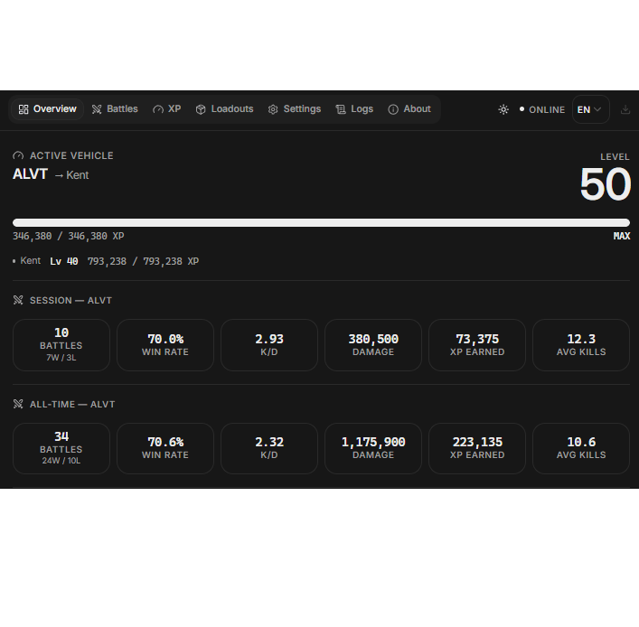

# HEAT Sentinel

**[English](#0-table-of-contents-en)** | **[Русский](#0-содержание-ru)**

> WoT: HEAT Sentinel is an unofficial statistics gathering app. It is not affiliated with, endorsed by, or sponsored by Wargaming Group Limited. All in-game assets and trademarks belong to their respective owners.

---

## Download

<!-- RELEASE-EN:START -->
[](https://github.com/OxCone1/HEAT-Sentinel/releases/download/v2.8.4/HEAT.Sentinel_2.8.4_x64-setup.exe)

**Latest release:** [v2.8.4](https://github.com/OxCone1/HEAT-Sentinel/releases/tag/v2.8.4) -- published 2026-09-17

| File | Size | VirusTotal report |
|------|------|------|
| [`HEAT.Sentinel_2.8.4_x64-setup.exe`](https://github.com/OxCone1/HEAT-Sentinel/releases/download/v2.8.4/HEAT.Sentinel_2.8.4_x64-setup.exe) (app installer) | 144.9 MB | [View scan](https://www.virustotal.com/gui/file/9fae6a5d337343e2c34fe7430dca43ce43cc208c1afbaa30957e7cae161ec131) |
| `heat-capture.exe` (capture/watcher engine, bundled inside the installer) | 37.7 MB | [View scan](https://www.virustotal.com/gui/file/19424f2188aa581dc0798e9cb9c88f48894be4e2a047caea6f52d184ae447ff8) |
<!-- RELEASE-EN:END -->

Every release is built by GitHub Actions and scanned on VirusTotal. See [Security and Privacy](#11-security-and-privacy) for details.

---

## 0. Table of Contents (EN)

| English Table of Contents | Russian Table of Contents |
|---------------------------|---------------------------|
| [Download](#download)<br>0. [Table of Contents (EN)](#0-table-of-contents-en)<br>1. [Navigation](#1-navigation)<br>2. [Project Overview](#2-project-overview)<br>3. [Installation and First Launch](#3-installation-and-first-launch)<br>4. [Overlays: In-Game and Stream (OBS)](#4-overlays-in-game-and-stream-obs)<br>5. [Marks of Excellence](#5-marks-of-excellence)<br>6. [Game UI: In-Game Customization](#6-game-ui-in-game-customization)<br>7. [Build Links](#7-build-links)<br>8. [How HEAT Sentinel Reads the Game](#8-how-heat-sentinel-reads-the-game)<br>9. [Calibrations and Patterns](#9-calibrations-and-patterns)<br>10. [Contributing](#10-contributing)<br>11. [Security and Privacy](#11-security-and-privacy)<br>12. [Future Expansion](#12-future-expansion)<br>13. [Disclaimer](#13-disclaimer)<br>14. [Troubleshooting](#14-troubleshooting)<br>15. [Acknowledgements](#15-acknowledgements) | [Скачать](#скачать)<br>0. [Содержание (RU)](#0-содержание-ru)<br>1. [Навигация](#1-навигация)<br>2. [Обзор проекта](#2-обзор-проекта)<br>3. [Установка и первый запуск](#3-установка-и-первый-запуск)<br>4. [Оверлеи: внутриигровой и для стрима (OBS)](#4-оверлеи-внутриигровой-и-для-стрима-obs)<br>5. [Отметки на стволе (Marks of Excellence)](#5-отметки-на-стволе-marks-of-excellence)<br>6. [Game UI: настройка интерфейса игры](#6-game-ui-настройка-интерфейса-игры)<br>7. [Ссылки на сборки](#7-ссылки-на-сборки)<br>8. [Как HEAT Sentinel читает игру](#8-как-heat-sentinel-читает-игру)<br>9. [Калибровки и паттерны](#9-калибровки-и-паттерны)<br>10. [Участие в проекте](#10-участие-в-проекте)<br>11. [Безопасность и приватность](#11-безопасность-и-приватность)<br>12. [Планы развития](#12-планы-развития)<br>13. [Дисклеймер](#13-дисклеймер)<br>14. [Устранение неполадок](#14-устранение-неполадок)<br>15. [Благодарности](#15-благодарности) |

---

## 1. Navigation

| Section | Description | Link |
|---------|-------------|------|
| Project Overview | What HEAT Sentinel is and everything it can do | [Section 2](#2-project-overview) |
| Installation and First Launch | Download, install, first run, sessions, moving your data to a new PC | [Section 3](#3-installation-and-first-launch) |
| Overlays: In-Game and Stream (OBS) | In-game overlay, stream overlay editor, OBS setup, real-time sync | [Section 4](#4-overlays-in-game-and-stream-obs) |
| Marks of Excellence | How marks are earned and kept, calibration packs, the public marks page | [Section 5](#5-marks-of-excellence) |
| Game UI | Hiding HUD elements, custom reticles, colours, player tags, Sentinel Friends, platoon QOL | [Section 6](#6-game-ui-in-game-customization) |
| Build Links | Sharing a build as a link, and integrating a planner site | [Section 7](#7-build-links) |
| How HEAT Sentinel Reads the Game | The main capture mode and the Legacy OCR reserve | [Section 8](#8-how-heat-sentinel-reads-the-game) |
| Calibrations and Patterns | What they are and why they are kept here | [Section 9](#9-calibrations-and-patterns) |
| Contributing | How to help: reticles, translations, game data, calibrations | [Section 10](#10-contributing) |
| Security and Privacy | VirusTotal scans, SmartScreen, local-only data, what goes over the network | [Section 11](#11-security-and-privacy) |
| Future Expansion | Where the project is heading | [Section 12](#12-future-expansion) |
| Disclaimer | Fair play rules and legal notes | [Section 13](#13-disclaimer) |
| Troubleshooting | Update failures, closing all instances, sending logs | [Section 14](#14-troubleshooting) |

---

## 2. Project Overview

### What is HEAT Sentinel?

HEAT Sentinel is a desktop companion for **World of Tanks: HEAT**: a battle statistics tracker, a Marks of Excellence system, an in-game overlay, a stream overlay and a set of in-game interface customizations in one app. It quietly runs alongside the game, records your battles, XP, loadouts and head-to-head records, and can show all of it live on top of your game or your stream. It can also restyle and trim the game's own interface, draw custom reticles, mark the players you care about on the scoreboard, and show what you are playing on your Discord profile.

The core idea is simple: the game shows you a lot of interesting numbers and then throws most of them away. HEAT Sentinel catches those numbers, keeps them, and turns them into history, aggregates, marks and live widgets.

**No account. No registration. No cloud.** Everything HEAT Sentinel records is stored locally on your machine and is not shared with anyone.

### Key Features

<p align="center">
  
</p>

**Automatic Battle Tracking**
- Battle results are captured automatically as you play: outcome, personal performance, team stats, map, mode, vehicle, agent and the loadout you took in
- Every player in the match is recorded with their full in-game identity, so two players sharing a nickname are never mixed up
- Full battle history inside the app, with Overview, Battle list, Trends and Session views, plus breakdowns by vehicle, agent, map and game mode
- Click any tank for its full report: maps, modes, streaks, damage share, recent battles, and its **peak** win rate and average damage
- Platoon tracking: per-map and per-vehicle-combo stats for the people you platoon with
- Mid-battle tank swaps are split per tank, so every tank gets credit only for its own work
- Statistics filters: leave chosen game modes, maps or tank-swap battles out of every stat page at once
- Live match card on the Overview: the battle you are in, or the queue you are sitting in, updated as it happens

**Marks of Excellence**
- Up to three marks per tank, earned by how much damage per minute you deal compared with other players on the same tank and mode
- Your standing, what the next mark needs, and which battle drops out of the window next, for every tank you play
- Marks on the in-game overlay and the stream overlay, with a live projection during the battle
- Balanced through public calibration packs published in this repository. See [Section 5](#5-marks-of-excellence)

**XP, Loadouts and Builds**
- Vehicle and agent XP and every vehicle's modules, equipment and agent perks are read from your account automatically, including tanks you have never taken into battle
- Named builds, a Build Composer that enforces the energy budget and slot rules as you build, and one-click apply back into the game
- Share any build as a one-line code or a `sentinel://` link; planner sites can send builds straight into the game. See [Section 7](#7-build-links)

**Head-to-Head (1v1) Records**
- Running score against every named opponent you have fought: how many times you fragged them and how many times they fragged you, ranked by net kills
- Open any rival for the full breakdown: your best and worst tanks against them, theirs against you, best mode and map per side, and the complete encounter log
- Rivals are recorded from the moment the app is installed onwards; battles played before that cannot be reconstructed

**In-Game Overlay**
- A transparent overlay drawn directly on top of the game, separate from the stream overlay
- Stat tiles and strips, module gauges for abilities such as the SIS-90 and the PDU-1546S, a team composition panel, Marks of Excellence and Marks goal elements, and free text
- Built-in editor: move, resize, recolour, merge tiles into one plate, snap to grid, and show any element only when it is useful, for example while aiming or only during a round
- A toggle hotkey and a separate hide hotkey, both rebindable

**Game UI: Customize the Game Itself**
- Hide individual HUD, radar, nameplate, kill-feed, marker, scoreboard, map, deploy and hangar elements, and save the result as presets
- Custom reticle packs drawn under the game's HUD, from a public catalogue, and a browser tool to design your own
- A COLORS tab inside the game's own Settings screen, with colour-blindness profiles and shareable presets
- Player tags shown next to nicknames on the scoreboards, a Sentinel Friends tab in the hangar with squad invites, and platoon auto-ready / auto-search
- See [Section 6](#6-game-ui-in-game-customization)

**Discord Rich Presence**
- Your Discord profile shows what you are actually doing: the hangar, the matchmaking queue, or the tank, map and objective mode of the battle in progress
- Optional live K/D/A and damage line, switchable off
- One toggle in Settings, no other setup

**Customizable Stream Overlay**
- Transparent browser overlay served locally, designed for OBS Browser Source or any browser
- Click-to-add element palette: all-time stats, session stats, recent battles, per-agent / per-vehicle / per-map statistics, Marks of Excellence, win/loss streaks, XP and levels, decorative shapes
- Move, resize and style every element freely on a resolution-aware canvas
- Win/loss/draw accent colors, grid snapping, presets, layout sharing
- Real-time sync between your browser and the OBS source: edit the layout live while streaming

**Quality of Life**
- The tracker runs in the background whenever the app is open, ready to record the moment a battle finishes. There is nothing to start or stop by hand
- Battle recording can be switched off in Settings if you only want the in-game features
- Selectable colour schemes, plus an opt-in "v2" interface look under Settings > Personalisation (the classic look stays the default)
- The app's own title bar, matching your theme, with back/forward buttons and a live connection readout
- The Battles, Platoons and Loadouts views can each be scoped to a single session or shown as all-time data
- Control over how much per-battle detail is kept on disk: keep it for every battle, or save the individual battles you care about
- Move your whole history to another PC with a preview before anything is written
- Built-in update check and in-app updater, with release notes shown after each update
- Twelve app interface languages; the capture pipeline understands all game client languages

### Closed Source Notice

The application source code is not public. This repository is the public home of the project: releases, documentation, calibrations, patterns, localisation data, the build-link catalogue, the reticle catalogue, the Marks of Excellence calibration packs and community contributions all live here.

---

## 3. Installation and First Launch

### Download

Grab the latest installer from the [Download](#download) section at the top of this page, or from the [Releases page](https://github.com/OxCone1/HEAT-Sentinel/releases).

### Installation Steps

1. **Run the installer** (`HEAT.Sentinel_<version>_x64-setup.exe`).
2. **Windows SmartScreen will most likely warn you.** This is expected for an unsigned application from a small developer: click "More info", then "Run anyway". Read [Security and Privacy](#11-security-and-privacy) to understand exactly why this happens and how you can verify every build yourself.
3. **Launch HEAT Sentinel** from the Start Menu or desktop shortcut and follow the first-launch setup. It asks for your game folder, because the app switches on the interface debugging port in the game's configuration file: that port is how it reads the game's screens. If the game was already running, restart it once.
4. **Play the game.** The tracker runs in the background as long as the app is open and records every battle automatically.

### After Installing

There is no calibration step and nothing to walk through. The first time the game reaches the hangar with the app running, HEAT Sentinel reads your vehicles, their XP, their fitted modules, equipment and perks, and your agents straight from your account data, including tanks you have not played yet. When you change a loadout in the game, the change is picked up on its own.

If a game update ever resets the game's debugging setting, the app notices and restores it, and tells you when the game needs a restart to pick it up.

### Sessions

A session starts automatically with your first battle and carries over across battles (and across app/game restarts) until you end it. Two controls are available in the app:

- **New Session** ends the current session; your next battle starts a fresh one. Existing history is preserved either way.
- **Continue Last Session** re-attaches to the most recently played session, useful if you accidentally started a new one or reopened the app.

Session statistics in the app and overlays always reflect whichever session is currently active.

### Where Your Data Lives

All recorded data (battles, XP, loadouts, marks, settings) is stored in a local database in your Windows user profile. It survives app updates and reinstalls, and it is not removed on uninstall unless you ask for it, so you will not lose your history by upgrading.

### Moving Your Data to a New PC

Everything HEAT Sentinel records lives in one file, `heat_local.db`, kept in this folder:

```
%LOCALAPPDATA%\com.oxcone.heat-sentinel
```

Paste that path into the Explorer address bar to open the folder, then find `heat_local.db` inside it. There is no export step -- that file **is** the export. Copy it to the new machine (USB stick, cloud drive, anywhere), then import it there.

**On the old PC**

1. Quit HEAT Sentinel from the tray icon (right-click, Quit). Copying the file while the app is running can miss your most recent battles.
2. Copy `heat_local.db` somewhere you can reach from the new PC.

**On the new PC**

1. Install and launch HEAT Sentinel at least once, so it creates its own database.
2. Open **Settings -> Processing & Storage**. The storage backend must be set to **Local (SQLite)**.
3. Click **Import** and pick the `heat_local.db` you brought over.
4. Nothing is written yet. The app reads the file and shows what is inside: how many battles, XP records, loadouts and battle details it holds, and how many of those this PC already has.
5. Choose what should happen to records both PCs have (see below), then click **Import**. A progress bar runs to the end, and the capture service restarts afterwards so the new battles appear.

An import only adds to your history -- it never clears it. Battles already on the new PC stay where they are.

#### What Gets Imported

| Imported | Not imported |
|----------|--------------|
| Battles, including ones you deleted | App settings |
| Vehicle and agent XP | Overlay layout and hotkeys |
| Vehicle loadouts | Statistics filters |
| Duplicate-detection fingerprints | Player tags |
| Per-tick battle detail (optional) | |

Settings describe the machine they are on, so yours stay exactly as you have set them here. The per-tick battle detail is what powers the detailed view of a single battle; it is by far the largest part of the file, so there is a checkbox to leave it out if you only want the battles themselves.

#### Duplicate Records

Every battle carries an id derived from what happened in it and from the play session it happened in. The same battle therefore has the same id in both databases, and two different battles never share one -- which is what makes "do I already have this?" answerable without guesswork.

The dialog shows the overlap per row before you commit, and offers two ways to resolve it:

- **Keep the local record** (default) -- your existing rows win, and only genuinely new ones are added. Importing the same file twice is harmless: the second run adds nothing.
- **Use the imported record** -- the incoming version overwrites yours. Pick this when the file you are importing is the fuller or more recent one. Manual edits you made on this PC to those particular battles are lost.

Either way, the number added and the number that overlapped are reported when it finishes.

#### If Something Goes Wrong

| Message | What it means |
|---------|---------------|
| *That is the database this app is already using* | You picked the live file rather than the copy brought from the other PC. |
| *This is a database, but its battles cannot be read* | The file is a SQLite database that HEAT Sentinel did not write. |
| *That file holds no records to import* | The file is one of ours but empty -- most likely a fresh install that never recorded a battle. |

The file you point at is never modified. The app works from a temporary copy of it, so an import that fails part-way leaves both databases exactly as they were, and you can simply try again.

### Updating

The app checks for updates on its own and can install them in place; release notes appear after each update. You can also simply install a newer release on top of the existing one; your data is preserved.

---

## 4. Overlays: In-Game and Stream (OBS)

HEAT Sentinel has two separate overlays. The **in-game overlay** is drawn by the app on top of the game itself and is for you, the player. The **stream overlay** is a browser page meant for OBS and is for your viewers. They are configured independently and can be used together or on their own.

### In-Game Overlay

The in-game overlay is a transparent window that sits over the game and shows live information while you play.

- **Open the editor** from the Overlay tab in the app, or toggle the overlay with the global hotkey (rebindable in Settings; if the default combination is already taken by another app on your machine, no hotkey is bound and Settings will say so, so pick your own).
- **Hide it in one keystroke.** The hide hotkey (Ctrl+Shift+H by default, rebindable on the Overlay tab) takes the overlay off screen until you press it again, without switching it off or touching your layout. There is also a Hide overlay button next to Edit layout.
- **Add elements** from the "add element" menu:
  - stat tiles and strips (session and all-time win rate, K/D, damage, placement, battle count, best damage, streaks); middle-click a tile in the editor to switch it between the whole session and the tank you are in;
  - module gauges for vehicle abilities such as the SIS-90 (M1E1) and the PDU-1546S Combat Reboot (XM1 90), with the bar or the number switchable off;
  - **Team composition**: both rosters as class icons filled to each vehicle's remaining health, coloured by side and platoon. Hold ALT in battle to expand it to tank names and HP, or keep it open;
  - **Marks of Excellence** for the tank you are in (compact, meter or full, with a custom row layout) and **Marks: Goal**, which shows the target line, the DPM you need and what your last battle did;
  - free text.
- **Arrange and style** every element: drag, resize, recolour, merge several tiles into one continuous plate (and split them again), and align with optional snap-to-grid (off by default, toggled from the magnet icon in the toolbar).
- **Set visibility rules** so an element only appears when it is relevant, for example while aiming down the gunner sight, in chase camera, or only during an active round.
- **Capture it in OBS** if you want: turn on "Show in taskbar" in Settings > Overlay and the overlay becomes a window OBS can capture. Use this only for OBS.

### Stream Overlay (OBS)

While the app is running, the stream overlay is served on your PC at:

```
http://localhost:17504/overlay
```

Open it in any browser to enter the editor. The sidebar contains an element palette and the overlay settings. It is only reachable from the same PC the app runs on.

### Editing Basics

- **Add elements** by clicking them in the palette. Categories include: All-Time, Session, Recent, Agents, Tanks, Marks of Excellence, Maps, Streak, XP / Levels and Decoration.
- **Move and resize** elements by dragging them or their handles on the canvas.
- **Style** the overlay in Settings: canvas resolution, win/loss/draw colors, element background color and opacity, grid and snapping, tank images and agent portraits, language.
- **Presets** let you save and switch between layouts; layouts can also be exported as a shareable string.

### Setting Up the Overlay in OBS (Step by Step)

1. **Open the overlay** at `http://localhost:17504/overlay` in your browser.
2. **(Optional but recommended) Upload an alignment image.** In the sidebar, open Settings, find the Alignment section, and upload a screenshot of your game. Adjust its opacity. This puts your game screen behind the canvas so you can position elements precisely over the actual game UI.
3. **Turn on sync.** In Settings, set **Sync** to **"Sync upload"**. Your layout changes are now pushed to every consumer running in "Sync download" mode.
4. **Arrange your layout** the way you want it.
5. **Add a Browser source in OBS**, placed **above all other sources** in your scene:
   - URL: `http://localhost:17504/overlay`
   - Width and height: your screen resolution (for example 1920 x 1080)
6. **Switch the OBS copy to download mode.** Select the Browser source in OBS and click "Interact". In the interaction window, open the sidebar Settings and set **Sync** to **"Sync download"**. The OBS copy now automatically pulls the layout from your browser tab.
7. **Enter transparency mode.** Once you are done, still in the interaction window, press the round button in the bottom-right corner of the overlay, or flip the switch on the floating control bar next to it. The editor background and UI disappear, leaving only your elements on a transparent background: this is what your stream shows. The corner button stays visible in the interaction window, so you can always switch back to editor mode.
8. **Edit in real time.** Keep the browser tab open and make changes there; the OBS source picks them up automatically within seconds. When you are happy with the layout, remove the alignment image.

That is the whole trick: your browser tab is the editor, the OBS source is the display, and the sync keeps them in step while you stream.

---

## 5. Marks of Excellence

Marks of Excellence live under **Battles > MoE**. Each tank can earn up to **three marks**, based on how much damage per minute you deal compared with other players in the same tank and the same game mode.

### How It Works

- **Damage per minute, not damage per battle.** A long battle and a quick stomp are put on the same footing, so there is no reward for stalling a match to farm damage.
- **Per tank and per mode.** Each battle is weighed against what regular players do in that tank and that mode, so a hard tank or a low-damage mode does not hold you back.
- **Your standing is your recent form.** It is the average of your last 50 countable battles in that tank. A new tank builds up from its very first game.
- **Mark lines** sit at the 65th, 85th and 95th percentile of regular players. Marks are **held, not permanent**: drop back under a line and that mark goes until you earn it back.
- **What counts:** PvP battles in the modes the calibration pack lists. Versus AI battles, other modes and bot-filled matches are left out. In a battle where you swapped tanks, only the tank you started in counts, and only for its own share of the battle. The tank's detail view lists every battle that was left out and exactly why.
- **Your record is protected.** Editing or deleting a battle never changes your marks.

### In the App

- Every tank's row shows its marks, its average on the scale, the battle that drops out of the window next, and what the next mark needs: either the damage rate for one battle, or a number of battles at your current level.
- Open a tank for its trend over the window, with each battle's gain or loss. Click a battle on the chart to open it in the battle list.
- **Click a mark stripe** to aim for that mark: the per-mode DPM targets and the in-battle projection follow it.
- A notification tells you when a mark is earned or lost (it can be turned off in Settings).
- The **Recent balance** button shows the notes for the latest calibration changes.

On the overlays, the Marks of Excellence element shows the tank you are in and, during a battle, projects where that battle would leave your average. It is available on the in-game overlay and the stream overlay.

### Calibration Packs

The numbers behind the marks (the damage baseline, the mark lines, each tank's and each mode's factor, the bot limit, the modes that count) are not built into the app. They come from **calibration packs** published in the [`moe/`](moe/) folder of this repository, together with notes on what changed. The app checks for a new pack every half hour, and each battle is always scored with the pack that was in force on the day it was played.

Packs are tuned from real battle data and from community feedback. If a tank feels too easy or too hard, say so on the [Discord server](https://discord.gg/AjfcuhDDw5).

### The Public Marks Page

**[oxcone1.github.io/HEAT-Sentinel/marks](https://oxcone1.github.io/HEAT-Sentinel/marks/)** shows the current pack in the browser, no app needed: the mark lines, every tank's and mode's factor, and a battle calculator that answers "what does a mark actually cost on this tank?". It reads the same packs from this repository, so it is always up to date.

---

## 6. Game UI: In-Game Customization

The **Game UI** tab changes the game's own interface. Everything here is applied to a running game within moments and comes back on its next launch. None of it reveals anything the game does not already show you.

### Battle HUD

Hide individual interface elements from a checklist: battle HUD parts, radar layers, vehicle nameplate rows, kill-feed entry types, world markers, capture bars, parts of the aim circle, event and mission panels, and elements on the Tab/scoreboard, map, deploy and hangar screens. Save a set of hidden elements as a named preset and switch between presets at any time.

### Sight (Custom Reticles)

The **Sight** tab applies **reticle packs**: complete redesigns of your crosshair, reload, magazine, overheat gauge and second gun, drawn beneath the game's HUD so every other widget stays on top.

- **A public catalogue.** The included reticles come from the [`reticles/`](reticles/) folder of this repository, so new and updated designs arrive without an app update. Each pack fits every gun in the game: single-shot guns, drums and carousels, long magazines, heat-based guns and two-gun vehicles (the gun not firing is dimmed).
- **Your placement.** Each pack has its own on/off switch, placement (including a fixed aim point placement, where the frame stays still and the gun marker settles into it), a **Pack size** slider and a **Spread circle size** slider. The spread circle follows the game's own rule exactly.
- **Keep what you like.** Choose which of the game's own crosshair parts stay on screen alongside the pack.
- **Design your own with [Sight Forge](https://oxcone1.github.io/HEAT-Sentinel/forge/).** A browser tool that draws reticles with the same renderer the app uses in the game, runs a simulated gun underneath so you can see every reload and magazine state, and, while HEAT Sentinel is running, previews your design live on your battle HUD as you edit it.
- **Get featured.** Finished a design you are proud of? Share it on the Discord server or open a pull request against [`reticles/`](reticles/) (see [Contributing](#10-contributing)) and it can join the catalogue for everyone.

### Colors

A **COLORS** tab appears inside the game's own Settings screen, next to GAMEPLAY, VIDEO, AUDIO, MOUSE and CONTROLS. It covers vehicle markers, capture points, the HUD and the scoreboard, and comes with a preset strip and colour-blindness profiles (protanopia, deuteranopia, tritanopia). The same controls are in the app under Game UI > Colors.

- Save colours as named presets, switch between them, and export a preset as a share code for someone else to import.
- Clip team colours to the battlefield nameplates only, leaving the compass, kill feed, battle log, scoreboard and results screen on the game's own colours.
- Switch all overrides off without losing the colours you picked.

### Tags

Tag the players you meet: **Dangerous**, **Low skill**, **Friend**, **Hmmm** and **Hunt down**. Right-click a player on a battle's scoreboard or on a rival card to tag them. Their tag icons then appear next to their nickname on the in-game Tab scoreboard and the post-battle tables. The game has room for three icons per player, so you choose each player's priority order; icons can be recoloured to stay readable, and one switch turns all marking off. Tags are private to your PC.

### Friends

A **SENTINEL FRIENDS** tab is added to the game's own hangar menu. It lists everyone you tagged as a friend, shows who is online, and sends a squad invite without leaving the game. Turn it on or off from Game UI > Friends.

### QOL

Platoon helpers that press the game's own menu buttons for you, and nothing else:

- **Auto-ready** as a platoon member when you get back to the lobby after a battle.
- **Auto-search** as the platoon leader, starting the battle search once every member is ready (with an optional delay).

---

## 7. Build Links

### Sharing a build

Any build in HEAT Sentinel can leave the app as a **share code** -- one line of
text -- or as a **build link**:

```
sentinel://build/HEAT1.eyJ2IjoxLCJ2ZWhpY2xlIjoi...
```

Send either to anyone. Clicking a link opens HEAT Sentinel, decodes the build
against your own game data, and shows it beside whatever is fitted on that tank
right now. Nothing is written until you press Apply.

**Builds > Export** gives you both: *Copy code* for places that mangle links,
*Copy link* for everywhere else. To take one in, use **Builds > Import**, or
just click a link.

A build travels as the parts it is made of, and nothing else. Names of modules,
equipment and perks, the vehicle, your label for it, and the module you starred
as the point of the build. **Not** the battles, win rate or damage behind it --
a record is earned, not transferred, and it accumulates the more its owner plays.

**A link never spends anything.** A build naming parts you do not own is not
applied silently: those parts are listed and skipped, and buying them takes a
separate hold-to-confirm that shows the exact cost.

**If you already have the build**, the app names which of your builds it is and
offers to take the sender's label and starred module -- rather than making a
second card you cannot tell from the first.

The `sentinel:` scheme is claimed for your Windows user the first time HEAT
Sentinel runs. If a link does nothing, the app has not been installed and
launched yet -- paste the code into Builds > Import instead.

### Building from scratch

The **Build Composer** designs a loadout from nothing, or starts from a fitted
vehicle or any saved or past build. It enforces the energy budget, the
equipment slots and the one-legendary / one-perk-per-group limits live as you
build, so whatever it produces can be applied as it is.

### For loadout planner sites

If you run a build planner on the web, you can hand players a link instead of a
list of module names to copy across by hand. It needs no API key, no server and
no partnership: a build link is a string you generate offline.

- **[Build links for HEAT Sentinel](docs/build-share-codes.md)** -- the
  integration guide. The link format, the build object, the rules a valid build
  follows, and encoders in JavaScript and Python.
- **[`public-catalog/`](public-catalog/)** -- the vocabulary, as JSON. Every
  vehicle, module, equipment item, perk and agent, keyed by the technical name a
  code is written in, with display names in all twelve languages the game ships.

The catalog carries no account data, no numeric ids and no artwork, and is
regenerated after game patches. `catalog.json` holds a SHA-256 per file, so you
can tell a real update from a re-upload.

---

## 8. How HEAT Sentinel Reads the Game

### Main Mode

HEAT Sentinel reads game values directly from the game client's own interface: the same numbers that are already drawn on your screen. The game's interface is built like a web page, and the game ships with a debugging port for it; the app switches that port on in the game's configuration file and reads the interface through it. No screenshots, no image recognition, no guessing. This makes it fast, exact and independent of your screen resolution and game language.

Important: the app only ever reads information that is already visible to you during normal play. It does not touch the game's memory, does not modify the game's executables, and does not expose anything hidden. See the [Disclaimer](#13-disclaimer).

### Legacy OCR (Reserve)

Unofficial tools live at the mercy of game updates. Before the main mode existed, HEAT Sentinel read the game from screenshots, and that pipeline, **Legacy OCR**, is kept in reserve in case a future patch ever closes the main mode off. It no longer ships inside the installer (dropping it made the download roughly 180 MB smaller), and the app always uses the main mode.

How Legacy OCR works, for the curious:

1. **Screen watching.** Screenshots of the game at the right moments (lobby, end-of-battle screens, module screens).
2. **Pattern matching.** Small reference images, called **patterns**, recognize which screen is currently visible.
3. **Text recognition.** An OCR engine reads the text from specific regions of the screenshot. Where exactly each value lives is defined by **calibrations**.
4. **Parsing.** The recognized values are assembled into the same battle records the main mode produces.

All of it runs locally; screenshots never leave your PC. Its limits are why it is the reserve and not the default: it depends on screen resolution and game language, and it sees far less than the main mode.

---

## 9. Calibrations and Patterns

These two words belong to Legacy OCR. The files live in this repository so the reserve path stays ready.

### Calibrations

A calibration is a JSON file (created with the LabelMe annotation tool) paired with a reference screenshot. It marks rectangles on the screen and labels them: "this box is the damage number", "this box is the player name", and so on. The OCR engine only reads inside those boxes, which is what makes recognition reliable.

Calibrations exist per screen type, per resolution, per game language. Naming convention:

```
<screen>_<width>x<height>_<LANG>.json      e.g. personal_1920x1080_EN.json
```

Screen types covered: lobby, team score screens (5v5 and 10v10), personal result, modules.

### Patterns

A pattern is a small cropped PNG image used to recognize which game screen is currently displayed and to anchor the reading positions. Naming convention:

```
<name>_pattern_<width>x<height>_<LANG>.png   e.g. lobby_pattern_1920x1080_EN.png
```

### What Exists Today

A **1920x1080 English** calibration and pattern set. Other resolutions and game languages are welcome from the community.

### Contributing New Calibrations

1. Download **Light-LabelMe** (`labelme.exe`) from the [Releases page](https://github.com/OxCone1/HEAT-Sentinel/releases). It is a trimmed build of the LabelMe annotation tool used to create all existing calibrations.
2. Take clean screenshots of each relevant game screen at your resolution and language.
3. Open a screenshot in Light-LabelMe and draw labeled regions, using the existing `1920x1080_EN` files in this repository as the reference for which labels are expected.
4. Crop the matching pattern images.
5. Submit a pull request to this repository following the naming conventions above, or open an issue and attach your files if pull requests are not your thing.

---

## 10. Contributing

The application itself is closed source, but everything that makes it work across languages, game versions and tastes is open and lives in this repository. Contributions are very welcome:

- **Reticles** for the [`reticles/`](reticles/) catalogue. One folder per reticle, named after its id, holding a `reticle.json` manifest, the drawing (a pack exported from [Sight Forge](https://oxcone1.github.io/HEAT-Sentinel/forge/) is the easiest route) and an optional `preview.png`. Every reticle needs a stated `license`; if you did not draw it, you need the author's permission and credit. The manifest fields are documented in [`reticles/schema/reticle.schema.json`](reticles/schema/reticle.schema.json).
- **Localisation**: translations of app strings and of the game data tables in [`game_locales/`](game_locales/) and [`configs/`](configs/)
- **Game data updates** after game patches
- **Marks of Excellence feedback**: tanks or modes that feel off, with battles to back it up
- **Calibrations and patterns** for new resolutions and game languages (see [Section 9](#9-calibrations-and-patterns))
- **Documentation** fixes and improvements

Open an issue to discuss an idea, or submit a pull request directly. If you found a bug in the app itself, an issue with steps to reproduce is the way to go.

---

## 11. Security and Privacy

The "great, another crypto miner" jokes are funny, and honestly fair as far as random internet executables go. But I take the security aspect seriously, so here is the full picture:

- **Every release is built by GitHub Actions.** No hand-built binaries from a random machine; the build pipeline is reproducible automation.
- **Every release is scanned on VirusTotal.** Each published build, both the app installer and the bundled capture engine, is uploaded to VirusTotal, and the scan links are published right in the [Download](#download) section of this page.
- **Updates are signed.** The in-app updater only installs a release whose signature matches the key built into the app.

### About Antivirus False Positives

The data capture engine is Python code compiled with **Nuitka** into a folder of ordinary program files. It used to be packed with PyInstaller into one self-extracting executable, a format some antivirus vendors flag generically because malware uses it too; moving to Nuitka removed most of those false positives. If you still see a handful of detections with generic names on an otherwise clean report, this is almost certainly why. The full report is always linked, judge for yourself.

### About Windows SmartScreen

SmartScreen warns about the installer because it is not code-signed. Code signing certificates cost serious money per year, which is not reasonable for a free hobby project, so the warning is unavoidable for now. "More info", then "Run anyway". The VirusTotal reports above exist precisely so you do not have to take my word for it.

### Privacy

- **No account, no registration.** The app never asks you to sign up for anything.
- **All data is stored locally** in a database on your machine: battles, XP, loadouts, marks, tags, settings.
- **Nothing is shared with anyone.** There is no telemetry and no data collection.
- **The local server stays on your PC.** The overlays are fed by a small server inside the app that only accepts connections from the same computer.

### What Goes Over the Network

Only downloads, and none of them carry your data:

- the update check against this repository's releases;
- the Marks of Excellence calibration packs and the reticle catalogue, fetched from this repository;
- Discord Rich Presence, if enabled, which talks to the Discord app on your own PC.

The full details are in the [Privacy Policy](PRIVACY.md).

---

## 12. Future Expansion

- **More statistics**: deeper aggregates, richer per-vehicle / per-agent / per-map breakdowns, more ways to slice your battle history, and more of it available as overlay widgets
- **Overlay improvements**: more element types and more editor quality of life, in both overlays
- **More reticles and in-game designs**: a growing reticle catalogue, together with the community, and more Sentinel-styled touches in the game's own interface
- **Marks of Excellence**: regular rebalancing as the game and its player base change
- **Opt-in online features**: live combat sharing between platooned HEAT Sentinel players, and a public web portal for the battles you choose to upload. Both are strictly opt-in: the app stays local-first, and the privacy policy is updated before any of it reaches a release
- **Linux**: builds for players who run the game through Proton
- **More calibration and pattern sets** for the Legacy OCR reserve, together with the community

---

## 13. Disclaimer

- **Unofficial Project**: WoT: HEAT Sentinel is an unofficial statistics gathering app. It is not affiliated with, endorsed by, or sponsored by Wargaming Group Limited. All in-game assets and trademarks belong to their respective owners.
- **Use at Your Own Risk**: The app is provided "as is", without warranties of any kind. While every effort goes into stability and safety, you use it at your own risk. Always be cautious with executables downloaded from the internet, and use the VirusTotal links provided with every release.
- **Fair Play by Design**: HEAT Sentinel only reads information that is already visible to you during legitimate play. Its interface features change how the game's own interface looks, never what it knows. It does not and will not:
  - expose or exploit game information that is not normally available to a player, or anything that could grant an unfair advantage over others;
  - modify the game's executables or alter its memory or processes;
  - automate gameplay: no auto-aim, no auto-fire, no scripted decisions, nothing that replaces human input in battle;
  - bypass or interfere with any anti-cheat, integrity or detection mechanism of the game.
- **What You Must Not Do**: by using HEAT Sentinel you agree not to:
  - use it, or attempt to modify it, to extract information not exposed through legitimate gameplay;
  - distribute modified versions of it that enable any of the behavior listed above;
  - bundle or advertise it together with tools whose purpose is cheating, hacking or exploiting the game;
  - sell or otherwise monetize modifications that violate these rules;
  - present it as affiliated with, endorsed by, or approved by Wargaming or World of Tanks: HEAT.
- **Support**: this is a free project developed in spare time. Bugs get fixed and ideas get considered as time allows; patience is appreciated, and contributions are welcome.

---

## 14. Troubleshooting

If a new version will not install or the app misbehaves after an update, work through these steps in order. Most update problems come from an old copy still running in the background.

1. **In-app update did not work? Download from GitHub directly.** If the built-in updater fails to apply a release, grab the installer straight from the [Releases page](https://github.com/OxCone1/HEAT-Sentinel/releases) and run it yourself.

2. **Installing over an existing version.** When you run the downloaded `.exe`:
   - **Preferably choose "Add or repair components"** (the repair option) if the installer offers it.
   - If that option is not shown, choose **"Do not uninstall"**. Do not remove the existing install first.

3. **Update still did not go through? Close every instance of HEAT Sentinel.** This means **both** the main app (HEAT Sentinel) **and** the capture engine (`heat-capture`). Open **Task Manager** and confirm that neither process is still running before trying the installer again.

4. **Still stuck? Uninstall the app first, then reinstall.** During uninstall there is a **second step** with an option to delete application data. **Do NOT click "delete application data."** Leaving it unchecked preserves your battle history and settings. After uninstalling, install the fresh release.

5. **Nothing above helped? Reboot and start over.** Restart your PC, then run the installer from the beginning.

6. **The app says it cannot reach the game after a game update?** Restart the game once. Game updates can reset the debugging setting the app reads through; the app restores it, but the game only picks it up on its next start.

7. **If none of this works, send your logs.** The logs are in `%LOCALAPPDATA%\HEAT Sentinel\logs`. Archive them into a single archive (`.zip` / `.7z`) and send it to the **Discord server** or to the developer's **personal DMs**. Both links are available on the **About page inside the app**.
   - If the archive is too large for Discord's file upload limit, upload it to any file exchange service and paste the link instead.

---

## 15. Acknowledgements

HEAT Sentinel would not be what it is today without the community members who tested early builds, reported bugs, gave feedback and helped shape its direction: AET9RNAL, sneakyConcept, Ustitsa_13, iSeNtYi, SINEWAVE, \_VEN0M, \_\_\_Oz\_\_\_, 99999999999999, lullabyvlr, T_A_N_K_I_S_T_E_G_O_R, Animaluos, Yzhe_Nikto, Sturcidus, Faustous_, Montainary, venom_OLEG_slabitelnoe and others.

**Special thanks to: odmarker228, Sturcidus, venom_OLEG_slabitelnoe, sneakyConcept**

---

## Need Help?

Running into a technical issue? Two options:

- **Open an issue** on the [Issues page](https://github.com/OxCone1/HEAT-Sentinel/issues) with steps to reproduce.
- **Join the Discord server**: [discord.gg/AjfcuhDDw5](https://discord.gg/AjfcuhDDw5) and ask there directly.

---

*Repository: https://github.com/OxCone1/HEAT-Sentinel*

---
---

# Документация на русском

> WoT: HEAT Sentinel -- неофициальное приложение для сбора статистики. Оно не связано с Wargaming Group Limited, не одобрено и не спонсируется ею. Все внутриигровые материалы и товарные знаки принадлежат их владельцам.

---

## Скачать

<!-- RELEASE-RU:START -->
[](https://github.com/OxCone1/HEAT-Sentinel/releases/download/v2.8.4/HEAT.Sentinel_2.8.4_x64-setup.exe)

**Последний релиз:** [v2.8.4](https://github.com/OxCone1/HEAT-Sentinel/releases/tag/v2.8.4) -- опубликован 2026-09-17

| Файл | Размер | Отчёт VirusTotal |
|------|------|------|
| [`HEAT.Sentinel_2.8.4_x64-setup.exe`](https://github.com/OxCone1/HEAT-Sentinel/releases/download/v2.8.4/HEAT.Sentinel_2.8.4_x64-setup.exe) (установщик приложения) | 144.9 MB | [Открыть отчёт](https://www.virustotal.com/gui/file/9fae6a5d337343e2c34fe7430dca43ce43cc208c1afbaa30957e7cae161ec131) |
| `heat-capture.exe` (движок захвата, встроен в установщик) | 37.7 MB | [Открыть отчёт](https://www.virustotal.com/gui/file/19424f2188aa581dc0798e9cb9c88f48894be4e2a047caea6f52d184ae447ff8) |
<!-- RELEASE-RU:END -->

Каждый релиз собирается через GitHub Actions и проверяется на VirusTotal. Подробнее в разделе [Безопасность и приватность](#11-безопасность-и-приватность).

---

## 0. Содержание (RU)

| Содержание на русском | English Table of Contents |
|-----------------------|---------------------------|
| [Скачать](#скачать)<br>0. [Содержание (RU)](#0-содержание-ru)<br>1. [Навигация](#1-навигация)<br>2. [Обзор проекта](#2-обзор-проекта)<br>3. [Установка и первый запуск](#3-установка-и-первый-запуск)<br>4. [Оверлеи: внутриигровой и для стрима (OBS)](#4-оверлеи-внутриигровой-и-для-стрима-obs)<br>5. [Отметки на стволе (Marks of Excellence)](#5-отметки-на-стволе-marks-of-excellence)<br>6. [Game UI: настройка интерфейса игры](#6-game-ui-настройка-интерфейса-игры)<br>7. [Ссылки на сборки](#7-ссылки-на-сборки)<br>8. [Как HEAT Sentinel читает игру](#8-как-heat-sentinel-читает-игру)<br>9. [Калибровки и паттерны](#9-калибровки-и-паттерны)<br>10. [Участие в проекте](#10-участие-в-проекте)<br>11. [Безопасность и приватность](#11-безопасность-и-приватность)<br>12. [Планы развития](#12-планы-развития)<br>13. [Дисклеймер](#13-дисклеймер)<br>14. [Устранение неполадок](#14-устранение-неполадок)<br>15. [Благодарности](#15-благодарности) | [Download](#download)<br>0. [Table of Contents (EN)](#0-table-of-contents-en)<br>1. [Navigation](#1-navigation)<br>2. [Project Overview](#2-project-overview)<br>3. [Installation and First Launch](#3-installation-and-first-launch)<br>4. [Overlays: In-Game and Stream (OBS)](#4-overlays-in-game-and-stream-obs)<br>5. [Marks of Excellence](#5-marks-of-excellence)<br>6. [Game UI: In-Game Customization](#6-game-ui-in-game-customization)<br>7. [Build Links](#7-build-links)<br>8. [How HEAT Sentinel Reads the Game](#8-how-heat-sentinel-reads-the-game)<br>9. [Calibrations and Patterns](#9-calibrations-and-patterns)<br>10. [Contributing](#10-contributing)<br>11. [Security and Privacy](#11-security-and-privacy)<br>12. [Future Expansion](#12-future-expansion)<br>13. [Disclaimer](#13-disclaimer)<br>14. [Troubleshooting](#14-troubleshooting)<br>15. [Acknowledgements](#15-acknowledgements) |

---

## 1. Навигация

| Раздел | Описание | Ссылка |
|--------|----------|--------|
| Обзор проекта | Что такое HEAT Sentinel и что он умеет | [Раздел 2](#2-обзор-проекта) |
| Установка и первый запуск | Скачивание, установка, первый запуск, сессии, перенос данных на новый ПК | [Раздел 3](#3-установка-и-первый-запуск) |
| Оверлеи и OBS | Внутриигровой оверлей, редактор оверлея для стрима, настройка OBS, синхронизация | [Раздел 4](#4-оверлеи-внутриигровой-и-для-стрима-obs) |
| Отметки на стволе | Как отметки зарабатываются и удерживаются, калибровочные пакеты, публичная страница отметок | [Раздел 5](#5-отметки-на-стволе-marks-of-excellence) |
| Game UI | Скрытие элементов HUD, свои прицелы, цвета, метки игроков, Sentinel Friends, помощники для взвода | [Раздел 6](#6-game-ui-настройка-интерфейса-игры) |
| Ссылки на сборки | Обмен сборками через ссылки и интеграция сайтов-планировщиков | [Раздел 7](#7-ссылки-на-сборки) |
| Как HEAT Sentinel читает игру | Основной режим захвата и резервный Legacy OCR | [Раздел 8](#8-как-heat-sentinel-читает-игру) |
| Калибровки и паттерны | Что это такое и зачем они хранятся здесь | [Раздел 9](#9-калибровки-и-паттерны) |
| Участие в проекте | Как помочь: прицелы, переводы, игровые данные, калибровки | [Раздел 10](#10-участие-в-проекте) |
| Безопасность и приватность | Проверки VirusTotal, SmartScreen, локальные данные, что уходит в сеть | [Раздел 11](#11-безопасность-и-приватность) |
| Планы развития | Куда движется проект | [Раздел 12](#12-планы-развития) |
| Дисклеймер | Правила честной игры и юридические заметки | [Раздел 13](#13-дисклеймер) |
| Устранение неполадок | Сбои обновления, закрытие всех процессов, отправка логов | [Раздел 14](#14-устранение-неполадок) |

---

## 2. Обзор проекта

### Что такое HEAT Sentinel?

HEAT Sentinel -- это настольный компаньон для **World of Tanks: HEAT**: трекер боевой статистики, система отметок на стволе, внутриигровой оверлей, оверлей для стрима и набор настроек игрового интерфейса в одном приложении. Он тихо работает рядом с игрой, записывает ваши бои, опыт, комплектации и личные счёты с противниками, и может показывать всё это в реальном времени поверх игры или стрима. Он также умеет перекрашивать и упрощать интерфейс самой игры, рисовать свои прицелы, помечать важных для вас игроков в таблице боя и показывать, во что вы играете, в профиле Discord.

Идея проста: игра показывает множество интересных цифр, а потом выбрасывает большинство из них. HEAT Sentinel эти цифры ловит, сохраняет и превращает в историю, сводную статистику, отметки и живые виджеты.

**Без аккаунта. Без регистрации. Без облака.** Всё, что записывает HEAT Sentinel, хранится локально на вашем компьютере и никому не передаётся.

### Основные возможности

<p align="center">
  
</p>

**Автоматический учёт боёв**
- Результаты боёв записываются автоматически по ходу игры: исход, личная эффективность, статистика команд, карта, режим, техника, агент и комплектация, с которой вы вышли в бой
- Каждый игрок боя записывается с полной игровой идентичностью, так что два игрока с одинаковым ником никогда не путаются
- Полная история боёв в приложении: обзор, список, тренды и сессия, плюс разбивка по технике, агентам, картам и режимам
- Кликните по любому танку, чтобы открыть полный отчёт: карты, режимы, серии, доля урона, последние бои, а также его **пиковый** винрейт и средний урон
- Учёт взводов: статистика по картам и по сочетаниям техники для тех, с кем вы играете во взводе
- Смена танка посреди боя разделяется по танкам, так что каждый танк получает только свою часть работы
- Фильтры статистики: исключите выбранные режимы, карты или бои со сменой танка сразу со всех страниц статистики
- Карточка текущего боя на главной: бой, в котором вы находитесь, или очередь, в которой стоите, обновляется в реальном времени

**Отметки на стволе**
- До трёх отметок на каждый танк, в зависимости от того, сколько урона в минуту вы наносите по сравнению с другими игроками на том же танке и в том же режиме
- Ваш текущий уровень, что нужно для следующей отметки и какой бой следующим выпадет из окна, для каждого танка, на котором вы играете
- Отметки во внутриигровом оверлее и в оверлее для стрима, с прогнозом прямо во время боя
- Баланс задаётся публичными калибровочными пакетами из этого репозитория. См. [Раздел 5](#5-отметки-на-стволе-marks-of-excellence)

**Опыт, комплектации и сборки**
- Опыт техники и агентов, а также модули, снаряжение и перки агентов для каждой машины читаются из вашего аккаунта автоматически, включая танки, на которых вы ещё не играли
- Именованные сборки, конструктор сборок (Build Composer), который прямо во время сборки следит за бюджетом энергии и правилами слотов, и применение в игру одним кликом
- Любой сборкой можно поделиться строкой-кодом или ссылкой `sentinel://`; сайты-планировщики могут отправлять сборки прямо в игру. См. [Раздел 7](#7-ссылки-на-сборки)

**Личные счёты (1v1)**
- Счёт против каждого именованного противника, с которым вы сталкивались: сколько раз вы убили его и сколько раз он убил вас, с сортировкой по разнице фрагов
- Откройте любого соперника, чтобы увидеть подробности: ваша лучшая и худшая техника против него, его лучшая и худшая против вас, лучший режим и карта для каждой стороны и полный журнал встреч
- Соперники записываются с момента установки приложения; бои, сыгранные до этого, восстановить нельзя

**Внутриигровой оверлей**
- Прозрачный оверлей, который рисуется прямо поверх игры, отдельно от оверлея для стрима
- Плитки и полосы со статистикой, шкалы модулей для способностей вроде SIS-90 и PDU-1546S, панель состава команд, элементы отметок на стволе и цели по отметкам, а также произвольный текст
- Встроенный редактор: перемещение, изменение размера и цвета, объединение плиток в одну панель, привязка к сетке и условия видимости, чтобы элемент появлялся только тогда, когда он нужен, например при прицеливании или только во время раунда
- Горячая клавиша включения и отдельная горячая клавиша скрытия, обе переназначаются

**Game UI: настройка самой игры**
- Скрытие отдельных элементов HUD, миникарты, табличек над техникой, киллфида, маркеров, таблицы, карты, экрана высадки и ангара, с сохранением наборов в пресеты
- Свои наборы прицелов, которые рисуются под HUD игры, из публичного каталога, и браузерный инструмент, чтобы нарисовать свой
- Вкладка COLORS прямо в настройках игры, с профилями для людей с нарушениями цветовосприятия и пресетами, которыми можно делиться
- Метки игроков рядом с никами в таблицах боя, вкладка Sentinel Friends в ангаре с приглашением во взвод, а также авто-готовность и авто-поиск для взвода
- См. [Раздел 6](#6-game-ui-настройка-интерфейса-игры)

**Discord Rich Presence**
- В профиле Discord видно, чем вы заняты на самом деле: ангар, очередь подбора боя или техника, карта и режим текущего боя
- Опциональная строка с K/D/A и уроном в реальном времени, её можно отключить
- Один переключатель в настройках, больше ничего настраивать не нужно

**Настраиваемый оверлей для стрима**
- Прозрачный браузерный оверлей, раздаётся локально, рассчитан на OBS Browser Source и любой браузер
- Палитра элементов в один клик: статистика за всё время, за сессию, последние бои, статистика по агентам / технике / картам, отметки на стволе, серии побед и поражений, опыт и уровни, декоративные фигуры
- Каждый элемент можно свободно перемещать, масштабировать и оформлять на холсте с поддержкой разных разрешений
- Акцентные цвета побед/поражений/ничьих, сетка с привязкой, пресеты, обмен раскладками
- Синхронизация в реальном времени между браузером и источником в OBS: редактируйте раскладку прямо во время стрима

**Удобство**
- Трекер работает в фоне, пока открыто приложение, и готов записать результат сразу после боя. Запускать или останавливать его вручную не нужно
- Запись боёв можно отключить в настройках, если вам нужны только внутриигровые функции
- Выбор цветовых схем и опциональный внешний вид интерфейса "v2" в разделе Settings > Personalisation (классический вид остаётся по умолчанию)
- Собственная строка заголовка окна в цветах вашей темы, с кнопками назад/вперёд и индикатором подключения
- Разделы боёв, взводов и комплектаций можно смотреть как за отдельную сессию, так и за всё время
- Контроль над тем, сколько подробных данных по бою хранится на диске: держать их для каждого боя или сохранять только интересные бои
- Перенос всей истории на другой ПК с предпросмотром до того, как что-либо будет записано
- Встроенная проверка обновлений и обновление прямо из приложения, со списком изменений после каждого обновления
- Двенадцать языков интерфейса приложения; конвейер захвата понимает все языки игрового клиента

### О закрытом исходном коде

Исходный код приложения не публикуется. Этот репозиторий -- публичный дом проекта: релизы, документация, калибровки, паттерны, файлы локализации, каталог для ссылок на сборки, каталог прицелов, калибровочные пакеты отметок на стволе и вклад сообщества живут здесь.

---

## 3. Установка и первый запуск

### Скачивание

Возьмите свежий установщик из раздела [Скачать](#скачать) в начале этой страницы или со [страницы релизов](https://github.com/OxCone1/HEAT-Sentinel/releases).

### Порядок установки

1. **Запустите установщик** (`HEAT.Sentinel_<версия>_x64-setup.exe`).
2. **Windows SmartScreen скорее всего покажет предупреждение.** Это ожидаемо для неподписанного приложения от небольшого разработчика: нажмите "Подробнее", затем "Выполнить в любом случае". В разделе [Безопасность и приватность](#11-безопасность-и-приватность) подробно объясняется, почему так происходит и как самостоятельно проверить любую сборку.
3. **Запустите HEAT Sentinel** из меню Пуск или с ярлыка на рабочем столе и пройдите первоначальную настройку. Она попросит указать папку с игрой: приложение включает отладочный порт интерфейса в конфигурационном файле игры, и именно через этот порт читает игровые экраны. Если игра уже была запущена, перезапустите её один раз.
4. **Играйте.** Пока приложение открыто, трекер работает в фоне и записывает каждый бой автоматически.

### После установки

Никакой калибровки и никаких обязательных шагов. Как только игра с запущенным приложением дойдёт до ангара, HEAT Sentinel прочитает вашу технику, её опыт, установленные модули, снаряжение и перки, а также ваших агентов прямо из данных аккаунта, включая танки, на которых вы ещё не играли. Если вы меняете комплектацию в игре, изменение подхватывается само.

Если обновление игры сбросит её отладочную настройку, приложение это заметит и восстановит её, а также сообщит, когда игру нужно перезапустить, чтобы настройка вступила в силу.

### Сессии

Сессия начинается автоматически с вашего первого боя и продолжается через бои (и через перезапуски приложения и игры), пока вы её не завершите. В приложении доступны два действия:

- **New Session** (Новая сессия) завершает текущую сессию; следующий бой начнёт новую. История сохраняется в любом случае.
- **Continue Last Session** (Продолжить последнюю сессию) заново подключается к последней сыгранной сессии -- пригодится, если сессия была случайно начата заново или после переоткрытия приложения.

Статистика сессии в приложении и оверлеях всегда показывает именно ту сессию, которая активна сейчас.

### Где хранятся ваши данные

Все записанные данные (бои, опыт, комплектации, отметки, настройки) хранятся в локальной базе в профиле пользователя Windows. Они переживают обновления и переустановки приложения и не удаляются при деинсталляции, если вы сами этого не попросите, так что история при обновлении не теряется.

### Перенос данных на новый ПК

Всё, что записывает HEAT Sentinel, лежит в одном файле `heat_local.db` в этой папке:

```
%LOCALAPPDATA%\com.oxcone.heat-sentinel
```

Вставьте этот путь в адресную строку Проводника, чтобы открыть папку, и найдите в ней `heat_local.db`. Отдельного экспорта нет -- этот файл **и есть** экспорт. Скопируйте его на новый компьютер (флешка, облако, что угодно) и импортируйте там.

**На старом ПК**

1. Закройте HEAT Sentinel через иконку в трее (правая кнопка, Quit). Копирование файла при работающем приложении может потерять самые свежие бои.
2. Скопируйте `heat_local.db` туда, откуда его будет видно с нового ПК.

**На новом ПК**

1. Установите и хотя бы раз запустите HEAT Sentinel, чтобы он создал свою базу.
2. Откройте **Настройки -> Обработка и хранение**. Хранилище должно быть переключено на **Локально (SQLite)**.
3. Нажмите **Импорт** и выберите принесённый `heat_local.db`.
4. Пока ничего не записывается. Приложение читает файл и показывает, что в нём: сколько боёв, записей опыта, комплектаций и детализации боёв, и сколько из этого на этом ПК уже есть.
5. Выберите, что делать с записями, которые есть на обоих ПК (см. ниже), и нажмите **Импортировать**. Полоса прогресса дойдёт до конца, после чего служба захвата перезапустится, чтобы новые бои появились в интерфейсе.

Импорт только добавляет к вашей истории и никогда её не очищает. Бои, уже имеющиеся на новом ПК, остаются на месте.

#### Что импортируется

| Импортируется | Не импортируется |
|---------------|------------------|
| Бои, включая удалённые | Настройки приложения |
| Опыт техники и агентов | Раскладка оверлея и горячие клавиши |
| Комплектации техники | Фильтры статистики |
| Отпечатки для поиска дубликатов | Метки игроков |
| Детализация боёв по тикам (опционально) | |

Настройки описывают конкретную машину, поэтому ваши остаются ровно такими, какими вы их здесь задали. Детализация по тикам -- это то, из чего строится подробный разбор отдельного боя; она занимает основную часть файла, поэтому её можно не импортировать, сняв галочку, если нужны только сами бои.

#### Дубликаты записей

У каждого боя есть идентификатор, выведенный из того, что в нём произошло, и из игровой сессии, в которой он был сыгран. Поэтому один и тот же бой имеет один и тот же идентификатор в обеих базах, а два разных боя никогда не получают общий -- благодаря этому вопрос «есть ли это у меня уже?» решается без догадок.

Диалог показывает пересечение по каждой строке до подтверждения и предлагает два варианта:

- **Оставить локальную запись** (по умолчанию) -- побеждают ваши существующие записи, добавляются только действительно новые. Повторный импорт того же файла безвреден: второй раз он ничего не добавит.
- **Взять запись из файла** -- импортируемая версия перезапишет вашу. Выбирайте, если импортируемый файл полнее или свежее. Ручные правки, сделанные на этом ПК для этих боёв, будут потеряны.

В обоих случаях по завершении показывается, сколько записей добавлено и сколько пересеклось.

#### Если что-то пошло не так

| Сообщение | Что это значит |
|-----------|----------------|
| *That is the database this app is already using* | Выбран рабочий файл приложения, а не копия с другого ПК. |
| *This is a database, but its battles cannot be read* | Это база SQLite, но записана она не HEAT Sentinel. |
| *That file holds no records to import* | Файл наш, но пустой -- скорее всего, свежая установка, не записавшая ни одного боя. |

Выбранный вами файл никогда не изменяется. Приложение работает с его временной копией, поэтому прерванный импорт оставляет обе базы ровно в том виде, в каком они были, и его можно просто повторить.

### Обновление

Приложение само проверяет обновления и может установить их на месте; после каждого обновления показывается список изменений. Можно и просто установить новый релиз поверх старого: данные сохранятся.

---

## 4. Оверлеи: внутриигровой и для стрима (OBS)

В HEAT Sentinel два независимых оверлея. **Внутриигровой оверлей** рисуется приложением поверх самой игры и предназначен для вас, игрока. **Оверлей для стрима** -- это браузерная страница для OBS, предназначенная для зрителей. Они настраиваются отдельно и могут использоваться вместе или по отдельности.

### Внутриигровой оверлей

Внутриигровой оверлей -- это прозрачное окно поверх игры, показывающее актуальную информацию прямо во время боя.

- **Откройте редактор** на вкладке Overlay в приложении или включите оверлей глобальной горячей клавишей (переназначается в настройках; если сочетание по умолчанию уже занято другим приложением на вашем компьютере, горячая клавиша не назначается и настройки честно об этом сообщат, чтобы вы выбрали своё).
- **Скройте его одним нажатием.** Клавиша скрытия (по умолчанию Ctrl+Shift+H, переназначается на вкладке Overlay) убирает оверлей с экрана до следующего нажатия, не выключая его и не трогая раскладку. Рядом с Edit layout есть и кнопка Hide overlay.
- **Добавляйте элементы** через меню "add element":
  - плитки и полосы со статистикой (винрейт, K/D, урон, место, число боёв, лучший урон, серии -- за сессию и за всё время); клик средней кнопкой мыши по плитке в редакторе переключает её между всей сессией и танком, на котором вы сейчас;
  - шкалы модулей для способностей техники, например SIS-90 (M1E1) и PDU-1546S Combat Reboot (XM1 90), с возможностью отключить полосу или число;
  - **Состав команд**: оба состава в виде иконок классов, заполненных по оставшейся прочности каждой машины и окрашенных по стороне и взводу. Удерживайте ALT в бою, чтобы развернуть его до названий танков и HP, или оставьте его раскрытым всегда;
  - **Отметки на стволе** для текущего танка (компактный, шкала или полный вид, со своей раскладкой строк) и **Marks: Goal** -- целевая линия, нужный DPM и результат вашего последнего боя;
  - произвольный текст.
- **Размещайте и оформляйте** любой элемент: перетаскивание, изменение размера и цвета, объединение нескольких плиток в одну сплошную панель (и обратное разделение), выравнивание с необязательной привязкой к сетке (по умолчанию выключена, включается иконкой магнита на панели инструментов).
- **Задавайте условия видимости**, чтобы элемент появлялся только когда он уместен: например, при прицеливании из прицела наводчика, в камере от третьего лица или только во время активного раунда.
- **Захватывайте его в OBS** при желании: включите "Show in taskbar" в Settings > Overlay, и оверлей станет окном, которое OBS может захватить. Используйте это только для OBS.

### Оверлей для стрима (OBS)

Пока приложение запущено, оверлей для стрима доступен на вашем ПК по адресу:

```
http://localhost:17504/overlay
```

Откройте его в любом браузере, чтобы попасть в редактор. В боковой панели находятся палитра элементов и настройки оверлея. Он доступен только с того же компьютера, на котором работает приложение.

### Основы редактирования

- **Добавляйте элементы** кликом по ним в палитре. Категории: за всё время, сессия, последние бои, агенты, техника, отметки на стволе, карты, серии, опыт / уровни, декорации.
- **Перемещайте и масштабируйте** элементы перетаскиванием на холсте.
- **Оформляйте** оверлей в настройках: разрешение холста, цвета побед/поражений/ничьих, цвет и прозрачность подложки элементов, сетка и привязка, изображения танков и портреты агентов, язык.
- **Пресеты** позволяют сохранять и переключать раскладки; раскладку также можно экспортировать строкой и делиться ею.

### Настройка оверлея в OBS (по шагам)

1. **Откройте оверлей** по адресу `http://localhost:17504/overlay` в браузере.
2. **(Необязательно, но рекомендуется) Загрузите изображение для выравнивания.** В боковой панели откройте настройки, найдите секцию Alignment и загрузите скриншот вашей игры. Отрегулируйте прозрачность. Скриншот окажется позади холста, и вы сможете расставить элементы точно поверх реального интерфейса игры.
3. **Включите синхронизацию.** В настройках переключите **Sync** в режим **"Sync upload"**. Теперь изменения раскладки отправляются всем потребителям, работающим в режиме "Sync download".
4. **Расставьте элементы** так, как вам нужно.
5. **Добавьте источник "Браузер" в OBS**, разместив его **выше всех остальных источников** сцены:
   - URL: `http://localhost:17504/overlay`
   - Ширина и высота: разрешение вашего экрана (например, 1920 x 1080)
6. **Переключите копию в OBS в режим приёма.** Выберите источник "Браузер" в OBS и нажмите "Взаимодействовать". В окне взаимодействия откройте настройки боковой панели и переключите **Sync** в режим **"Sync download"**. Теперь копия в OBS автоматически подтягивает раскладку из вашей вкладки браузера.
7. **Включите режим прозрачности.** Когда всё готово, там же в окне взаимодействия нажмите круглую кнопку в правом нижнем углу оверлея или переключите тумблер на плавающей панели рядом с ней. Фон редактора и интерфейс исчезнут, останутся только ваши элементы на прозрачном фоне: именно это увидят зрители. Кнопка в углу остаётся видимой в окне взаимодействия, так что вернуться в режим редактора можно в любой момент.
8. **Редактируйте в реальном времени.** Держите вкладку браузера открытой и вносите изменения в ней: источник в OBS подхватит их автоматически за считанные секунды. Когда раскладка готова, уберите изображение для выравнивания.

В этом весь фокус: вкладка браузера -- редактор, источник в OBS -- экран, а синхронизация держит их в согласии, пока вы стримите.

---

## 5. Отметки на стволе (Marks of Excellence)

Отметки на стволе находятся в разделе **Бои > Отметки** (MoE). Каждый танк может получить до **трёх отметок** -- в зависимости от того, сколько урона в минуту вы наносите по сравнению с другими игроками на том же танке и в том же режиме.

### Как это работает

- **Урон в минуту, а не урон за бой.** Долгий бой и быстрый разгром поставлены в равные условия, поэтому затягивать бой ради урона бессмысленно.
- **По танку и по режиму.** Каждый бой сравнивается с тем, что делают обычные игроки на этом танке и в этом режиме, так что сложный танк или режим с низким уроном вас не тормозят.
- **Ваш уровень -- это ваша текущая форма.** Это среднее по последним 50 засчитываемым боям на этом танке. Новый танк набирает уровень с самого первого боя.
- **Линии отметок** стоят на 65-м, 85-м и 95-м перцентиле обычных игроков. Отметки **удерживаются, а не выдаются навсегда**: опуститесь ниже линии -- и отметка пропадёт, пока вы не заработаете её снова.
- **Что засчитывается:** PvP-бои в режимах, перечисленных в калибровочном пакете. Бои против ИИ, другие режимы и бои, заполненные ботами, не учитываются. В бою со сменой танка засчитывается только танк, на котором вы начали, и только за его собственную часть боя. В подробном виде танка перечислены все неучтённые бои и точная причина.
- **Ваши результаты защищены.** Редактирование или удаление боя никогда не меняет ваши отметки.

### В приложении

- Строка каждого танка показывает его отметки, среднее значение на шкале, бой, который следующим выпадет из окна, и что нужно для следующей отметки: либо темп урона за один бой, либо число боёв на вашем текущем уровне.
- Откройте танк, чтобы увидеть тренд по окну с приростом или потерей за каждый бой. Клик по бою на графике открывает его в списке боёв.
- **Кликните по полосе отметки**, чтобы нацелиться на неё: цели по DPM для каждого режима и прогноз в бою подстроятся под неё.
- Уведомление сообщает, когда отметка получена или потеряна (его можно отключить в настройках).
- Кнопка **Recent balance** показывает заметки о последних изменениях калибровки.

В оверлеях элемент отметок показывает танк, на котором вы сейчас, а во время боя прогнозирует, куда этот бой сдвинет ваше среднее. Он доступен и во внутриигровом оверлее, и в оверлее для стрима.

### Калибровочные пакеты

Числа, на которых держатся отметки (базовый урон, линии отметок, коэффициенты каждого танка и режима, лимит ботов, засчитываемые режимы), не зашиты в приложение. Они приходят из **калибровочных пакетов**, которые публикуются в папке [`moe/`](moe/) этого репозитория вместе с заметками об изменениях. Приложение проверяет наличие нового пакета каждые полчаса, а каждый бой всегда оценивается тем пакетом, который действовал в день боя.

Пакеты настраиваются по реальным данным боёв и по отзывам сообщества. Если какой-то танк кажется слишком лёгким или слишком сложным, расскажите об этом на [Discord-сервере](https://discord.gg/AjfcuhDDw5).

### Публичная страница отметок

**[oxcone1.github.io/HEAT-Sentinel/marks](https://oxcone1.github.io/HEAT-Sentinel/marks/)** показывает текущий пакет прямо в браузере, без приложения: линии отметок, коэффициенты всех танков и режимов и калькулятор боя, который отвечает на вопрос «сколько на самом деле стоит отметка на этом танке?». Страница читает те же пакеты из этого репозитория, поэтому всегда актуальна.

---

## 6. Game UI: настройка интерфейса игры

Вкладка **Game UI** меняет собственный интерфейс игры. Всё здесь применяется к запущенной игре за считанные мгновения и возвращается при её следующем запуске. Ничто из этого не раскрывает того, чего игра и так вам не показывает.

### HUD боя

Скрывайте отдельные элементы интерфейса по списку: части боевого HUD, слои миникарты, строки табличек над техникой, типы записей в киллфиде, маркеры мира, полосы захвата, части круга прицеливания, панели событий и заданий, а также элементы на экране Tab (таблица), карте, экране высадки и в ангаре. Сохраняйте набор скрытых элементов как именованный пресет и переключайтесь между пресетами в любой момент.

### Прицел (свои прицелы)

Вкладка **Прицел** применяет **наборы прицелов**: полную переработку перекрестья, перезарядки, магазина, шкалы перегрева и второго орудия, нарисованную под HUD игры, так что все остальные виджеты остаются сверху.

- **Публичный каталог.** Встроенные прицелы берутся из папки [`reticles/`](reticles/) этого репозитория, поэтому новые и обновлённые дизайны приходят без обновления приложения. Каждый набор подходит ко всем орудиям игры: однозарядным, барабанам и каруселям, длинным магазинам, орудиям с перегревом и технике с двумя орудиями (неактивное орудие приглушается).
- **Ваше размещение.** У каждого набора свой переключатель, размещение (включая фиксированную точку прицеливания, где рамка стоит на месте, а маркер орудия сходится в неё), ползунок **Pack size** и ползунок **Spread circle size**. Круг разброса в точности следует правилу самой игры.
- **Оставьте то, что нравится.** Выберите, какие части родного прицела игры остаются на экране вместе с набором.
- **Нарисуйте свой в [Sight Forge](https://oxcone1.github.io/HEAT-Sentinel/forge/).** Браузерный инструмент, который рисует прицелы тем же движком, что и приложение в игре, запускает под ними симуляцию орудия, чтобы видеть каждое состояние перезарядки и магазина, а при запущенном HEAT Sentinel показывает ваш дизайн прямо на боевом HUD по ходу редактирования.
- **Попадите в каталог.** Сделали дизайн, которым гордитесь? Поделитесь им на Discord-сервере или отправьте pull request в [`reticles/`](reticles/) (см. [Участие в проекте](#10-участие-в-проекте)), и он может стать частью каталога для всех.

### Цвета

Вкладка **COLORS** появляется прямо в экране настроек самой игры, рядом с GAMEPLAY, VIDEO, AUDIO, MOUSE и CONTROLS. Она охватывает маркеры техники, точки захвата, HUD и таблицу, и включает полосу пресетов и профили для людей с нарушениями цветовосприятия (протанопия, дейтеранопия, тританопия). Те же настройки есть в приложении в разделе Game UI > Цвета.

- Сохраняйте цвета как именованные пресеты, переключайтесь между ними и экспортируйте пресет кодом, чтобы другой игрок мог его импортировать.
- Ограничьте цвета команд только табличками над техникой на поле боя, оставив компас, киллфид, журнал боя, таблицу и экран результатов в родных цветах игры.
- Отключите все переопределения, не теряя выбранных цветов.

### Метки

Помечайте встреченных игроков: **Опасен**, **Низкий скилл**, **Друг**, **Hmmm** и **На отстрел**. Кликните правой кнопкой по игроку в таблице боя или на карточке соперника, чтобы поставить метку. Иконки меток затем появляются рядом с его ником в таблице Tab в игре и в послебоевых таблицах. В игре есть место для трёх иконок на игрока, поэтому порядок приоритета для каждого игрока выбираете вы; иконки можно перекрасить, чтобы они оставались читаемыми, а один переключатель отключает все метки сразу. Метки хранятся только на вашем ПК.

### Друзья

В меню ангара самой игры добавляется вкладка **SENTINEL FRIENDS**. Она показывает всех, кого вы пометили как друга, кто из них в сети, и позволяет пригласить во взвод, не выходя из игры. Включается и выключается в Game UI > Друзья.

### QOL

Помощники для взвода, которые нажимают кнопки меню самой игры за вас, и больше ничего:

- **Авто-готовность** участника взвода при возвращении в лобби после боя.
- **Авто-поиск** для командира взвода: поиск боя запускается, как только все участники готовы (с необязательной задержкой).

---

## 7. Ссылки на сборки

### Как поделиться сборкой

Любая сборка в HEAT Sentinel может покинуть приложение как **код обмена** --
одна строка текста -- или как **ссылка на сборку**:

```
sentinel://build/HEAT1.eyJ2IjoxLCJ2ZWhpY2xlIjoi...
```

Отправьте кому угодно. По клику откроется HEAT Sentinel, расшифрует сборку по
данным вашего клиента и покажет её рядом с тем, что стоит на этом танке сейчас.
Пока вы не нажмёте «Применить», ничего не записывается.

**Сборки > Экспорт** даёт и то, и другое: *Копировать код* для мест, где ссылки
ломаются, *Копировать ссылку* для всех остальных. Чтобы принять чужую сборку --
**Сборки > Импорт**, либо просто клик по ссылке.

Сборка передаётся как набор деталей, из которых она состоит, и ничего кроме.
Названия модулей, снаряжения и перков, машина, ваша подпись к сборке и модуль,
отмеченный как её смысл. **Не** передаются бои, процент побед и урон: результат
зарабатывается, а не передаётся, и накапливается тем больше, чем больше играет
его владелец.

**Ссылка ничего не тратит.** Сборка, называющая детали, которых у вас нет, не
применяется молча: они перечисляются и пропускаются, а покупка требует
отдельного подтверждения удержанием кнопки с показом точной цены.

**Если такая сборка у вас уже есть**, приложение скажет, какая именно, и
предложит взять у отправителя только подпись и отмеченный модуль -- вместо
второй карточки, неотличимой от первой.

Схема `sentinel:` закрепляется за вашим пользователем Windows при первом запуске
HEAT Sentinel. Если ссылка ничего не делает, приложение ещё не установлено и не
запускалось -- вставьте код через Сборки > Импорт.

### Сборка с нуля

**Build Composer** собирает комплектацию с чистого листа или отталкиваясь от
текущей комплектации машины, сохранённой или прошлой сборки. Он прямо по ходу
работы следит за бюджетом энергии, слотами снаряжения и ограничениями «одна
легендарная деталь / один перк на группу», поэтому результат можно применять
как есть.

### Для сайтов-планировщиков сборок

Если вы держите веб-планировщик сборок, вы можете отдавать игрокам ссылку вместо
списка названий модулей, который они переносят вручную. Не нужны ни ключ API, ни
сервер, ни партнёрство: ссылка на сборку -- это строка, которую вы формируете
офлайн.

- **[Build links for HEAT Sentinel](docs/build-share-codes.md)** -- руководство
  по интеграции (на английском). Формат ссылки, объект сборки, правила
  корректной сборки и кодировщики на JavaScript и Python.
- **[`public-catalog/`](public-catalog/)** -- словарь в виде JSON. Все машины,
  модули, снаряжение, перки и агенты по техническим именам, которыми
  записывается код, с отображаемыми названиями на всех двенадцати языках игры.

В каталоге нет данных аккаунта, числовых идентификаторов и изображений; он
пересобирается после игровых патчей. В `catalog.json` есть SHA-256 для каждого
файла, чтобы отличить настоящее обновление от повторной загрузки.

---

## 8. Как HEAT Sentinel читает игру

### Основной режим

HEAT Sentinel читает значения напрямую из интерфейса игрового клиента: те же самые цифры, которые уже нарисованы у вас на экране. Интерфейс игры устроен как веб-страница, и в игре есть для него отладочный порт; приложение включает этот порт в конфигурационном файле игры и читает интерфейс через него. Никаких скриншотов, никакого распознавания изображений, никаких догадок. Поэтому он быстрый, точный и не зависит от разрешения экрана и языка игры.

Важно: приложение читает только ту информацию, которая и так видна вам в обычной игре. Оно не трогает память игры, не изменяет её исполняемые файлы и не раскрывает ничего скрытого. См. [Дисклеймер](#13-дисклеймер).

### Legacy OCR (резерв)

Неофициальные инструменты живут на милости игровых обновлений. До появления основного режима HEAT Sentinel читал игру по скриншотам, и этот конвейер, **Legacy OCR**, сохраняется в резерве на случай, если какой-нибудь будущий патч закроет основной режим. В установщик он больше не входит (без него загрузка стала примерно на 180 МБ меньше), а приложение всегда работает в основном режиме.

Как работает Legacy OCR, для любопытных:

1. **Наблюдение за экраном.** Скриншоты игры в нужные моменты (лобби, послебоевые экраны, экраны модулей).
2. **Сопоставление паттернов.** Небольшие эталонные изображения, **паттерны**, распознают текущий экран.
3. **Распознавание текста.** OCR-движок читает текст из определённых областей скриншота. Где именно находится каждое значение, задают **калибровки**.
4. **Разбор.** Распознанные значения собираются в те же записи о боях, что и в основном режиме.

Всё это работает локально; скриншоты никогда не покидают ваш ПК. Его ограничения -- причина, по которой он резервный, а не основной: он зависит от разрешения экрана и языка игры и видит гораздо меньше, чем основной режим.

---

## 9. Калибровки и паттерны

Эти два слова относятся к Legacy OCR. Файлы хранятся в этом репозитории, чтобы резервный путь оставался наготове.

### Калибровки

Калибровка -- это JSON-файл (созданный в инструменте разметки LabelMe) в паре с эталонным скриншотом. Он размечает прямоугольники на экране и подписывает их: "в этой рамке число урона", "в этой рамке имя игрока" и так далее. OCR-движок читает только внутри этих рамок, что и делает распознавание надёжным.

Калибровки существуют для каждого типа экрана, разрешения и языка игры. Соглашение об именовании:

```
<экран>_<ширина>x<высота>_<ЯЗЫК>.json      например personal_1920x1080_EN.json
```

Покрытые типы экранов: лобби, таблицы результатов команд (5v5 и 10v10), личный результат, модули.

### Паттерны

Паттерн -- это небольшое обрезанное PNG-изображение, по которому распознаётся текущий игровой экран и привязываются позиции чтения. Соглашение об именовании:

```
<имя>_pattern_<ширина>x<высота>_<ЯЗЫК>.png   например lobby_pattern_1920x1080_EN.png
```

### Что есть сейчас

Набор калибровок и паттернов для **1920x1080 на английском языке**. Наборы для других разрешений и языков игры от сообщества приветствуются.

### Как добавить свои калибровки

1. Скачайте **Light-LabelMe** (`labelme.exe`) со [страницы релизов](https://github.com/OxCone1/HEAT-Sentinel/releases). Это облегчённая сборка инструмента разметки LabelMe, которым созданы все существующие калибровки.
2. Сделайте чистые скриншоты каждого нужного игрового экрана в вашем разрешении и на вашем языке.
3. Откройте скриншот в Light-LabelMe и разметьте области с подписями, ориентируясь на существующие файлы `1920x1080_EN` из этого репозитория: они показывают, какие метки ожидаются.
4. Вырежьте соответствующие изображения-паттерны.
5. Отправьте pull request в этот репозиторий, соблюдая соглашения об именовании выше, или откройте issue и приложите файлы, если pull request не ваш формат.

---

## 10. Участие в проекте

Само приложение имеет закрытый исходный код, но всё, что заставляет его работать на разных языках, версиях игры и под разные вкусы, открыто и живёт в этом репозитории. Вклад очень приветствуется:

- **Прицелы** для каталога [`reticles/`](reticles/). Одна папка на прицел, названная по его id, с манифестом `reticle.json`, самим рисунком (проще всего -- набор, экспортированный из [Sight Forge](https://oxcone1.github.io/HEAT-Sentinel/forge/)) и необязательным `preview.png`. У каждого прицела должна быть указана лицензия (`license`); если рисовали не вы, нужны разрешение автора и указание авторства. Поля манифеста описаны в [`reticles/schema/reticle.schema.json`](reticles/schema/reticle.schema.json).
- **Локализация**: переводы строк приложения и таблиц игровых данных в [`game_locales/`](game_locales/) и [`configs/`](configs/)
- **Обновления игровых данных** после патчей игры
- **Отзывы об отметках на стволе**: танки или режимы, которые кажутся несбалансированными, с боями в подтверждение
- **Калибровки и паттерны** для новых разрешений и языков игры (см. [Раздел 9](#9-калибровки-и-паттерны))
- **Документация**: исправления и улучшения

Откройте issue, чтобы обсудить идею, или сразу отправьте pull request. Если вы нашли баг в самом приложении, лучший путь -- issue с шагами воспроизведения.

---

## 11. Безопасность и приватность

Шутки в духе "отлично, ещё один криптомайнер" смешные и, честно говоря, справедливые, когда речь о случайных исполняемых файлах из интернета. Но к безопасности я отношусь серьёзно, поэтому вот полная картина:

- **Каждый релиз собирается через GitHub Actions.** Никаких собранных вручную бинарников с чьей-то машины: сборка полностью автоматизирована.
- **Каждый релиз проверяется на VirusTotal.** Каждая опубликованная сборка, и установщик приложения, и встроенный движок захвата, загружается на VirusTotal, а ссылки на отчёты публикуются прямо в разделе [Скачать](#скачать) этой страницы.
- **Обновления подписаны.** Встроенный апдейтер устанавливает только релиз, подпись которого совпадает с ключом, встроенным в приложение.

### О ложных срабатываниях антивирусов

Движок захвата данных -- это Python-код, скомпилированный с помощью **Nuitka** в папку обычных программных файлов. Раньше он упаковывался PyInstaller в один самораспаковывающийся исполняемый файл -- формат, который некоторые антивирусные вендоры помечают "на всякий случай", потому что им пользуются и злоумышленники; переход на Nuitka убрал большую часть таких ложных срабатываний. Если на в остальном чистом отчёте вы всё же видите несколько детектов с общими именами, почти наверняка причина в этом. Полный отчёт всегда по ссылке, судите сами.

### О Windows SmartScreen

SmartScreen предупреждает об установщике, потому что тот не подписан цифровой подписью. Сертификаты подписи кода стоят серьёзных денег в год, что неразумно для бесплатного хобби-проекта, поэтому предупреждение пока неизбежно. "Подробнее", затем "Выполнить в любом случае". Отчёты VirusTotal выше существуют именно для того, чтобы вам не приходилось верить мне на слово.

### Приватность

- **Без аккаунта и регистрации.** Приложение никогда не попросит вас нигде зарегистрироваться.
- **Все данные хранятся локально** в базе на вашем компьютере: бои, опыт, комплектации, отметки, метки игроков, настройки.
- **Ничего никому не передаётся.** Ни телеметрии, ни сбора данных.
- **Локальный сервер остаётся на вашем ПК.** Оверлеи получают данные от небольшого сервера внутри приложения, который принимает подключения только с этого же компьютера.

### Что уходит в сеть

Только загрузки, и ни одна из них не несёт ваших данных:

- проверка обновлений по релизам этого репозитория;
- калибровочные пакеты отметок на стволе и каталог прицелов, которые загружаются из этого репозитория;
- Discord Rich Presence, если он включён: он общается с приложением Discord на вашем же ПК.

Все подробности -- в [Политике конфиденциальности](PRIVACY.md) (на английском).

---

## 12. Планы развития

- **Больше статистики**: более глубокая сводная статистика, детальные разбивки по технике / агентам / картам, новые способы взглянуть на историю боёв, и больше всего этого в виде виджетов оверлея
- **Улучшения оверлеев**: новые типы элементов и больше удобства в редакторе, в обоих оверлеях
- **Больше прицелов и игрового оформления**: растущий каталог прицелов вместе с сообществом и новые штрихи в стиле Sentinel в собственном интерфейсе игры
- **Отметки на стволе**: регулярная балансировка по мере изменения игры и её аудитории
- **Онлайн-функции по желанию**: обмен боевой обстановкой в реальном времени между игроками HEAT Sentinel во взводе и публичный веб-портал для боёв, которые вы сами решите загрузить. Обе функции строго по желанию: приложение остаётся локальным в первую очередь, а политика конфиденциальности обновляется до того, как что-либо из этого попадёт в релиз
- **Linux**: сборки для игроков, запускающих игру через Proton
- **Новые наборы калибровок и паттернов** для резервного Legacy OCR, вместе с сообществом

---

## 13. Дисклеймер

- **Неофициальный проект**: WoT: HEAT Sentinel -- неофициальное приложение для сбора статистики. Оно не связано с Wargaming Group Limited, не одобрено и не спонсируется ею. Все внутриигровые материалы и товарные знаки принадлежат их владельцам.
- **Используйте на свой риск**: приложение поставляется "как есть", без каких-либо гарантий. Хотя в стабильность и безопасность вложено много усилий, вы используете его на свой страх и риск. Всегда будьте осторожны с исполняемыми файлами из интернета и пользуйтесь ссылками на VirusTotal, которые публикуются с каждым релизом.
- **Честная игра по замыслу**: HEAT Sentinel читает только ту информацию, которая и так видна вам в обычной игре. Его функции интерфейса меняют то, как выглядит собственный интерфейс игры, но никогда не то, что игра знает. Он не делает и не будет делать следующего:
  - раскрывать или использовать игровую информацию, недоступную игроку в обычной игре, или что-либо, дающее нечестное преимущество над другими;
  - изменять исполняемые файлы игры, её память или процессы;
  - автоматизировать игру: никакого авто-прицеливания, авто-стрельбы, скриптовых решений, ничего, что заменяет действия человека в бою;
  - обходить или мешать работе античита и любых механизмов контроля целостности игры.
- **Чего делать нельзя**: используя HEAT Sentinel, вы соглашаетесь не делать следующего:
  - использовать его или пытаться модифицировать для извлечения информации, недоступной в обычной игре;
  - распространять его изменённые версии, позволяющие что-либо из перечисленного выше;
  - распространять или рекламировать его вместе с инструментами, предназначенными для читерства, взлома или эксплуатации игры;
  - продавать или иным образом монетизировать модификации, нарушающие эти правила;
  - выдавать его за связанный с Wargaming или World of Tanks: HEAT, одобренный или утверждённый ими продукт.
- **Поддержка**: это бесплатный проект, который развивается в свободное время. Баги исправляются, а идеи рассматриваются по мере возможности; терпение ценится, а вклад приветствуется.

---

## 14. Устранение неполадок

Если новая версия не устанавливается или приложение ведёт себя некорректно после обновления, пройдите по шагам по порядку. Чаще всего причина проблем с обновлением -- старая копия, всё ещё работающая в фоне.

1. **Встроенное обновление не сработало? Скачайте с GitHub напрямую.** Если встроенный апдейтер не смог применить релиз, возьмите установщик прямо со [страницы релизов](https://github.com/OxCone1/HEAT-Sentinel/releases) и запустите его вручную.

2. **Установка поверх существующей версии.** Когда вы запускаете скачанный `.exe`:
   - **Предпочтительно выберите "Add or repair components"** (вариант восстановления/repair), если установщик его предлагает.
   - Если такого варианта нет, выберите **"Do not uninstall"** (не удалять). Не удаляйте существующую установку заранее.

3. **Обновление всё равно не прошло? Закройте все процессы HEAT Sentinel.** Это значит **и** само приложение (HEAT Sentinel), **и** движок захвата (`heat-capture`). Откройте **Диспетчер задач** и убедитесь, что ни один из этих процессов больше не запущен, прежде чем снова запускать установщик.

4. **Не помогло? Сначала удалите приложение, затем установите заново.** При удалении будет **второй шаг** с опцией удаления данных приложения. **НЕ нажимайте "delete application data" (удалить данные приложения).** Если оставить эту галочку снятой, ваша история боёв и настройки сохранятся. После удаления установите свежий релиз.

5. **Ничего из перечисленного не помогло? Перезагрузитесь и начните заново.** Перезагрузите ПК, затем запустите установщик с самого начала.

6. **После обновления игры приложение не может подключиться к ней?** Перезапустите игру один раз. Обновления игры могут сбрасывать отладочную настройку, через которую читает приложение; приложение её восстанавливает, но игра подхватывает её только при следующем запуске.

7. **Если ничего не помогло, отправьте логи.** Логи лежат в `%LOCALAPPDATA%\HEAT Sentinel\logs`. Упакуйте их в один архив (`.zip` / `.7z`) и отправьте на **Discord-сервер** или в **личные сообщения** разработчику. Обе ссылки есть на **странице About внутри приложения**.
   - Если архив слишком большой для лимита загрузки файлов в Discord, загрузите его на любой файлообменник и вставьте ссылку.

---

## 15. Благодарности

Отдельное спасибо тем, кто тестировал ранние версии, находил баги и своими советами помог довести HEAT Sentinel до того, чем он стал сегодня: AET9RNAL, sneakyConcept, Ustitsa_13, iSeNtYi, SINEWAVE, \_VEN0M, \_\_\_Oz\_\_\_, 99999999999999, lullabyvlr, T_A_N_K_I_S_T_E_G_O_R, Animaluos, Yzhe_Nikto, Sturcidus, Faustous_, Montainary, venom_OLEG_slabitelnoe и другим.

**Огромное спасибо: odmarker228, Sturcidus, venom_OLEG_slabitelnoe, sneakyConcept**

---

## Нужна помощь?

Столкнулись с технической проблемой? Два варианта:

- **Откройте issue** на [странице Issues](https://github.com/OxCone1/HEAT-Sentinel/issues) с шагами воспроизведения.
- **Присоединяйтесь к Discord-серверу**: [discord.gg/AjfcuhDDw5](https://discord.gg/AjfcuhDDw5) и спросите там напрямую.

---

*Репозиторий: https://github.com/OxCone1/HEAT-Sentinel*
